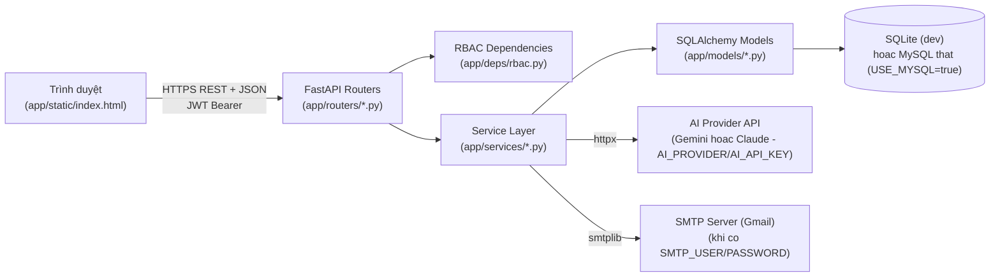

# STEP 1 — PROJECT DISCOVERY

**Phạm vi phân tích**: thư mục `ats-v2/` (không bao gồm `backend/`/`frontend/` ở thư mục gốc) — **[CONFIRMED bởi người dùng]**, OQ-01 đã được xác nhận: chỉ phân tích `ats-v2/`.

**Phương pháp**: đọc trực tiếp toàn bộ source code (`app/`), test (`tests/`), script E2E (`scripts/`), configuration (`requirements.txt`, `.env.example`, `.env`), và tài liệu đã có (`README.md`, `CONFLICT_REPORT_AND_BACKLOG.md`). Nhãn `[CONFIRMED]` / `[INFERRED]` / `[ASSUMED]` / `[MISSING]` áp dụng xuyên suốt theo đúng RULE 2.

---

## 1. Project Overview

**[CONFIRMED]** — theo `README.md` dòng 1 và `app/main.py`:
- Tên hệ thống: **ATS v2.1** — `FastAPI(title="ATS v2 API", version="2.1.0")` (`app/main.py`).
- Mô tả trong code: *"Recruitment Management System API - v2.1 (Offer 4-eyes approval, unlimited re-apply, prefixed Business ID)"*.
- Đây là implementation thật (không phải chỉ tài liệu) của một đặc tả nghiệp vụ (`ats_system_design_v2.md`, nằm ngoài `ats-v2/`, ở thư mục gốc dự án).
- Không có `LICENSE`, không có `package.json` (dự án Python thuần, không có phần Node.js).

**[INFERRED]** — hệ thống là một **Applicant Tracking System (ATS)** nội bộ doanh nghiệp, quản lý toàn bộ vòng đời tuyển dụng từ đăng tin, ứng viên nộp hồ sơ, sàng lọc (có hỗ trợ AI), phỏng vấn (ở mức tối thiểu), Offer, đến khi tuyển dụng thành công — suy ra từ tên bảng, endpoint và luồng nghiệp vụ trong `app/services/`.

## 2. Project Structure

**[CONFIRMED]** — cấu trúc thư mục thực tế (đã loại `.venv`, `__pycache__`, `uploads/`):

```
ats-v2/
├── .env, .env.example, .gitignore
├── CONFLICT_REPORT_AND_BACKLOG.md, README.md
├── requirements.txt
├── ats_v2.db                      # SQLite dev database (runtime artifact)
├── app/
│   ├── main.py                    # FastAPI entrypoint, lifespan, CORS, static mount
│   ├── core/                      # config.py, database.py, id_generator.py, security.py
│   ├── models/                    # 11 SQLAlchemy model + id_sequence.py + enums.py (12 file)
│   ├── schemas/                   # 8 file Pydantic (ai, application, auth, dashboard, email_template, job, offer, user)
│   ├── deps/rbac.py                # dependency xac thuc/phan quyen
│   ├── services/                  # 8 file business logic
│   ├── routers/                   # 10 file FastAPI router
│   ├── seed_data.py
│   └── static/
│       ├── index.html             # frontend chinh, single-file (Tailwind+Chart.js CDN, inline JS)
│       ├── css/style.css          # [CONFIRMED nhưng KHÔNG được index.html tham chiếu — xem mục 12]
│       └── js/app.js              # [CONFIRMED nhưng KHÔNG được index.html tham chiếu — xem mục 12]
├── tests/                          # 9 file pytest + conftest.py
└── scripts/                        # 3 script E2E qua HTTP thật (smoke_*.py)
```

**[CONFIRMED]** — tổng dung lượng code backend (`app/routers` + `app/services` + `app/models`): **2.632 dòng** (đo bằng `wc -l`).

## 3. Technology Stack

**[CONFIRMED]** — trích trực tiếp từ `requirements.txt` (version chỉ ghi khi có trong file, không đoán):

| Layer | Technology | Version | Evidence |
|---|---|---|---|
| Backend Framework | FastAPI | 0.115.0 | `requirements.txt` |
| ASGI Server | Uvicorn | 0.30.6 | `requirements.txt` |
| ORM | SQLAlchemy | 2.0.35 | `requirements.txt` |
| Validation | Pydantic | 2.9.2 | `requirements.txt` |
| Settings | pydantic-settings | 2.5.2 | `requirements.txt` |
| Email validation | email-validator | 2.2.0 | `requirements.txt` |
| Auth Token | python-jose[cryptography] | 3.3.0 | `requirements.txt` |
| Password Hashing | passlib + bcrypt | 1.7.4 / 4.0.1 | `requirements.txt` |
| File Upload | python-multipart | 0.0.9 | `requirements.txt` |
| Scheduler (dependency có sẵn, **chưa wiring** — xem mục 11) | APScheduler | 3.10.4 | `requirements.txt` |
| PDF Parsing | pypdf | 5.0.1 | `requirements.txt` |
| DOCX Parsing | python-docx | 1.1.2 | `requirements.txt` |
| HTTP Client (gọi AI Provider API — Gemini/Claude) | httpx | 0.27.2 | `requirements.txt` |
| Test Framework | pytest | 8.3.3 | `requirements.txt` |
| Database (dev/test) | SQLite | — (không ghi version, dùng driver chuẩn Python) | `app/core/config.py: database_url` mặc định `sqlite:///./ats_v2.db` |
| Database (production, tùy chọn) | MySQL | pymysql 1.1.1 | `app/core/config.py: use_mysql/mysql_*`, `app/core/database.py` — **[CẬP NHẬT sau STEP 1]** đã tích hợp và kiểm chứng chạy thật (trước đó ghi `[MISSING]` khi chỉ có SQLite) |
| Frontend | Vanilla JavaScript + Tailwind CSS (CDN) + Chart.js (CDN) | không ghi version cụ thể (CDN load bản mới nhất) | `app/static/index.html` |
| Frontend Icon | Font Awesome 6.4.0 | 6.4.0 | `app/static/index.html` (CDN URL có version) |
| Frontend Font | Google Fonts Inter | — | `app/static/index.html` |

**[CONFIRMED]** — không có build tool (Webpack/Vite), không có package manager JS (không có `package.json`) — frontend là 1 file HTML tĩnh phục vụ qua `StaticFiles`/`FileResponse` của FastAPI.

**[MISSING]** — không có Dockerfile, không có CI/CD config (`.github/workflows`, v.v.) trong `ats-v2/`.

## 4. Module Map

**[CONFIRMED]** — theo router (`app/routers/`), mỗi file = 1 module nghiệp vụ:

| Module (router file) | Prefix | Trách nhiệm |
|---|---|---|
| `auth.py` | `/auth` | Đăng ký (Candidate), đăng nhập, refresh token, thông tin bản thân |
| `users.py` | `/users` | Quản lý tài khoản HR/HR Manager/Admin (không quản lý Candidate) |
| `departments.py` | `/departments` | Danh mục phòng ban |
| `jobs.py` | `/jobs` | Tin tuyển dụng: tạo, đăng, gán HR, tìm kiếm |
| `applications.py` | `/applications` | Hồ sơ ứng tuyển: apply, đổi trạng thái, upload CV, withdraw, archive |
| `offers.py` | `/offers` | Offer: tạo, submit, duyệt (4-eyes), gửi, phản hồi |
| `email_templates.py` | `/email-templates` | Mẫu Email + gửi thủ công |
| `ai.py` | `/ai` | Kích hoạt AI Screening, xem lịch sử phân tích |
| `dashboard.py` | `/dashboard` | Số liệu tổng hợp |
| `audit.py` | `/audit-logs` | Xem nhật ký audit |

**[CONFIRMED]** — service layer (`app/services/`) tương ứng gần như 1-1 với module trên, cộng thêm 2 service hỗ trợ không có router riêng: `resume_parser.py` (trích xuất text PDF/DOCX — pure function, không gọi DB) và `audit_service.py` (ghi log, được các service khác gọi lại).

## 5. Actor / User Map

**[CONFIRMED]** — trực tiếp từ `app/models/enums.py::UserRole`:

```python
class UserRole(str, enum.Enum):
    CANDIDATE = "CANDIDATE"
    HR = "HR"
    HR_MANAGER = "HR_MANAGER"
    ADMIN = "ADMIN"
```

4 role cố định — **[CONFIRMED]** không có role thứ 5, không có bảng `roles`/`permissions` riêng (RBAC hard-code qua enum + dependency `app/deps/rbac.py`).

| Role | Đặc điểm | Bằng chứng |
|---|---|---|
| CANDIDATE | Tự đăng ký qua `POST /auth/register`; sở hữu 0-nhiều `candidates` record (qua `candidates.user_id`) | `app/routers/auth.py`, `app/models/candidate.py` |
| HR | Được ADMIN hoặc HR_MANAGER tạo qua `POST /users`; scope dữ liệu giới hạn theo `assigned_hr_id` | `app/routers/users.py`, `app/deps/rbac.py` |
| HR_MANAGER | Được ADMIN tạo; scope toàn hệ thống; là 1 trong 2 vai trò duyệt Offer | `app/routers/users.py`, `app/services/offer_service.py` |
| ADMIN | Tạo được mọi role; scope toàn hệ thống; không có ràng buộc bổ sung nào riêng cho ADMIN so với HR_MANAGER trong code hiện tại ngoài việc được tạo user ADMIN/HR_MANAGER | `app/routers/users.py::_ROLES_ADMIN_CAN_CREATE` |

**[INFERRED]** — vai trò "Hiring Manager" hoặc "Interviewer" độc lập **không tồn tại** như một `UserRole`; đánh giá phỏng vấn được ghi nhận qua 3 field tự do trên `interviews` (`hiring_manager_name`, `hiring_manager_email`, `hiring_manager_feedback` — xem `app/models/interview.py`), nghĩa là người phỏng vấn không có tài khoản trong hệ thống, chỉ được HR ghi hộ.

## 6. Feature Map (tóm tắt — chi tiết đầy đủ sẽ ở Function Catalog Phase 7)

**[CONFIRMED]**, nhóm theo router:

- **Authentication**: đăng ký Candidate, đăng nhập, refresh JWT, xem thông tin bản thân.
- **User Administration**: tạo tài khoản HR/HR Manager/Admin, liệt kê theo role.
- **Job Management**: tạo, đăng (publish), gán HR phụ trách, tìm kiếm/lọc.
- **Application (hồ sơ ứng tuyển)**: nộp hồ sơ (có idempotency + AI consent bắt buộc), đổi trạng thái theo state machine, upload CV (PDF/DOCX), rút hồ sơ, lưu trữ (archive), tìm kiếm/lọc.
- **Offer Management**: tạo, nộp duyệt, duyệt (bắt buộc người duyệt ≠ người tạo), gửi, ứng viên phản hồi (accept/decline), tự động hết hạn (hàm có sẵn, **chưa có lịch chạy tự động** — xem mục 11).
- **AI Screening**: phân tích CV so với JD, chấm điểm, lưu lịch sử (nhiều lần phân tích/1 hồ sơ), có 2 chế độ — gọi AI Provider thật (Gemini hoặc Claude, chọn qua `AI_PROVIDER`) hoặc chế độ stub (tự động chọn theo cấu hình).
- **Email Automation**: quản lý mẫu email, gửi thủ công, gửi tự động theo 5 sự kiện (nộp hồ sơ, shortlist, mời phỏng vấn, từ chối, gửi offer, chào mừng nhân viên mới), có 2 chế độ — SMTP thật hoặc ghi log giả lập.
- **Dashboard**: số liệu tổng hợp (phễu tuyển dụng, tỷ lệ nhận offer, thời gian tuyển trung bình, nguồn ứng viên, hiệu suất từng HR).
- **Audit Log**: ghi nhận các hành động nhạy cảm (không ghi mọi CRUD).

## 7. API Map

**[CONFIRMED]** — trích xuất trực tiếp bằng grep decorator `@router.*` trên toàn bộ `app/routers/`, tổng **35 endpoint**:

| Method | Path | Router |
|---|---|---|
| POST | `/auth/register` | auth |
| POST | `/auth/login` | auth |
| POST | `/auth/refresh` | auth |
| GET | `/auth/me` | auth |
| POST | `/users` | users |
| GET | `/users` | users |
| POST | `/departments` | departments |
| GET | `/departments` | departments |
| POST | `/jobs` | jobs |
| POST | `/jobs/{job_business_id}/assign-hr` | jobs |
| POST | `/jobs/{job_business_id}/publish` | jobs |
| GET | `/jobs` | jobs |
| GET | `/jobs/{job_business_id}` | jobs |
| POST | `/applications` | applications |
| GET | `/applications` | applications |
| GET | `/applications/{application_business_id}` | applications |
| POST | `/applications/{application_business_id}/resume` | applications |
| PUT | `/applications/{application_business_id}/status` | applications |
| PUT | `/applications/{application_business_id}/withdraw` | applications |
| PUT | `/applications/{application_business_id}/archive` | applications |
| POST | `/offers` | offers |
| GET | `/offers` | offers |
| GET | `/offers/{offer_business_id}` | offers |
| POST | `/offers/{offer_business_id}/submit` | offers |
| POST | `/offers/{offer_business_id}/approve` | offers |
| POST | `/offers/{offer_business_id}/reject` | offers |
| POST | `/offers/{offer_business_id}/send` | offers |
| POST | `/offers/{offer_business_id}/respond` | offers |
| POST | `/email-templates` | email_templates |
| GET | `/email-templates` | email_templates |
| PUT | `/email-templates/{template_business_id}` | email_templates |
| POST | `/email-templates/{template_business_id}/deactivate` | email_templates |
| POST | `/email-templates/send/{application_business_id}` | email_templates |
| POST | `/ai/analyze/{application_business_id}` | ai |
| GET | `/ai/analysis/{application_business_id}` | ai |
| GET | `/dashboard/summary` | dashboard |
| GET | `/audit-logs` | audit |

Cộng thêm: `GET /health` (health check) và `GET /` (serve `index.html`) — **[CONFIRMED]** `app/main.py`.

**[CONFIRMED]** — toàn bộ endpoint dùng **Business ID dạng chuỗi có tiền tố** (VD `UV0001`, `APP0002`, `OFF0003`) trong URL, không dùng khóa số nguyên tự tăng — xác nhận qua `app/core/id_generator.py::PREFIX_MAP`.

## 8. Database / Entity Map

**[CONFIRMED]** — 12 model SQLAlchemy trong `app/models/` (11 bảng nghiệp vụ + 1 bảng đếm nội bộ):

| # | Bảng (`__tablename__`) | File | Vai trò |
|---|---|---|---|
| 1 | `users` | `user.py` | Tài khoản đăng nhập (4 role) |
| 2 | `departments` | `department.py` | Danh mục phòng ban |
| 3 | `jobs` | `job.py` | Tin tuyển dụng |
| 4 | `candidates` | `candidate.py` | Hồ sơ ứng viên (tách khỏi `applications`) |
| 5 | `applications` | `application.py` | Lượt ứng tuyển (1 candidate — nhiều job) |
| 6 | `resumes` | `resume.py` | File CV + text trích xuất, 1-1 với `applications` |
| 7 | `ai_analyses` | `ai_analysis.py` | Kết quả AI Screening, 1-nhiều với `applications` |
| 8 | `interviews` | `interview.py` | Lịch/kết quả phỏng vấn |
| 9 | `offers` | `offer.py` | Thư mời nhận việc |
| 10 | `email_templates` | `email_template.py` | Mẫu email theo giai đoạn |
| 11 | `audit_logs` | `audit_log.py` | Nhật ký hành động nhạy cảm |
| — | `id_sequences` | `id_sequence.py` | Bảng đếm nội bộ phục vụ sinh Business ID (không phải entity nghiệp vụ) |

**[CONFIRMED]** — mỗi bảng nghiệp vụ có 2 loại khóa: `id` (INT, PK/FK kỹ thuật nội bộ) và `business_id` (VARCHAR, UNIQUE, expose ra API) — xác nhận đồng nhất trên cả 11 model.

Chi tiết cột từng bảng, quan hệ, constraint sẽ trình bày đầy đủ ở Phase 18/19 (ERD + Table Specification) — không lặp lại ở bước discovery này để tránh trùng lặp.

## 9. Architecture (sơ bộ)

**[CONFIRMED]** — kiến trúc 3 lớp (**Layered Architecture**), thể hiện qua cấu trúc thư mục và cách import:



**Giải thích**:
- **Client**: 1 file HTML tĩnh (`index.html`), không có framework SPA (không React/Vue/Angular), gọi API bằng `fetch()` thuần.
- **Router layer**: nhận request, xác thực input qua Pydantic schema, gọi RBAC dependency, gọi service — **không chứa business logic** (xác nhận qua việc mọi router đều `import` và gọi hàm từ `app/services/`).
- **Service layer**: chứa toàn bộ business logic (state machine, 4-eyes approval, sinh Business ID, gửi email/AI).
- **Model layer**: SQLAlchemy ORM, ánh xạ trực tiếp 1 class = 1 bảng.
- **External services**: AI Provider (Gemini hoặc Claude, chọn qua `AI_PROVIDER`) và SMTP (Email) — cả hai đều có **chế độ dự phòng nội bộ (stub/simulate)** khi thiếu cấu hình, xác nhận qua `app/services/ai_service.py::_is_ai_configured()` và `app/services/email_service.py::_is_smtp_configured()`.

**[CONFIRMED]** — không có message queue, không có cache layer (Redis), không có microservices — là **monolith đơn khối**.

## 10. Business Process (sơ bộ)

**[INFERRED]** từ state machine trong `app/services/application_service.py` (biến `FORWARD_EDGES`, `PIPELINE_ORDER`) kết hợp với `app/services/offer_service.py`:

```text
Candidate nộp hồ sơ (NEW)
  → HR chuyển SCREENING (thủ công, hoặc sau khi chạy AI Screening)
  → HR chuyển SHORTLISTED hoặc REJECTED
  → (nếu SHORTLISTED) HR chuyển INTERVIEW
  → HR tạo Offer (DRAFT) → submit (PENDING_APPROVAL)
  → Người khác (≠ người tạo) duyệt (APPROVED) hoặc từ chối (quay lại DRAFT)
  → HR gửi Offer (SENT, Application → OFFER)
  → Candidate Accept (Application → HIRED, tự động đóng Job nếu đủ quota)
    hoặc Decline (Application → REJECTED)
  → (song song) HR Manager/Admin có thể ARCHIVE hồ sơ bất kỳ lúc nào (trừ khi đã HIRED)
  → (song song) Candidate có thể tự WITHDRAW trước khi có Offer
```

Business Process chi tiết đầy đủ (actor, input/output từng bước, business rule) sẽ trình bày ở Phase 9/10 (BPMN).

## 11. Các điểm chưa rõ / thiếu bằng chứng

**[MISSING]**:
1. **Interview module chưa có API riêng** — bảng `interviews` tồn tại trong model nhưng **không có router nào** thao tác trực tiếp (không có `interview.py` trong `app/routers/`). Không tìm thấy endpoint tạo/sửa/xem lịch phỏng vấn.
2. **APScheduler đã cài (`requirements.txt`) nhưng không được import/khởi tạo ở bất kỳ đâu trong `app/`** — xác nhận bằng cách không tìm thấy `from apscheduler` trong toàn bộ `app/`. Hàm `offer_service.py::expire_due_offers()` tồn tại nhưng không có cơ chế gọi tự động (chỉ gọi được thủ công hoặc từ test).
3. **`app/static/css/style.css` và `app/static/js/app.js` tồn tại nhưng không được `index.html` tham chiếu** (xem mục 12 — Documentation Mismatch).
4. **File `ats_v2.db`** đang tồn tại trong thư mục gốc `ats-v2/` — là dữ liệu runtime (SQLite), không phải mã nguồn, nhưng cho thấy hệ thống **đã được chạy thật** ít nhất 1 lần.
5. **Alembic** (công cụ migration) có nhắc tới trong comment code (`app/main.py`: *"v2 Phan 17 backlog: thay bang Alembic migration truoc khi len production"*) nhưng **không có trong `requirements.txt`, không có thư mục `alembic/`** — xác nhận đây chỉ là kế hoạch, chưa triển khai.
6. **ClamAV/antivirus scan** cho file CV upload — có nhắc trong comment (`app/services/resume_parser.py`) là gap đã biết, không có code liên quan.
7. **Driver MySQL** (`pymysql` hoặc tương đương) không có trong `requirements.txt`, dù `README.md`/config đề cập MySQL 8.0 là lựa chọn production — nếu chạy MySQL thật sẽ thiếu dependency.

## 12. Mâu thuẫn giữa Documentation và Source Code (Documentation Mismatch)

**[CONFIRMED — mâu thuẫn]**:

| # | Mô tả mâu thuẫn | Bằng chứng | Ưu tiên xử lý khi mô tả "hệ thống hiện tại" |
|---|---|---|---|
| 1 | `README.md` mô tả frontend là "single-file (vanilla JS + Tailwind CDN)" và không nhắc tới file CSS/JS riêng, nhưng thực tế tồn tại `app/static/css/style.css` (699 dòng) và `app/static/js/app.js` (804 dòng) là một bộ frontend **khác**, có vẻ là một phiên bản UI được tạo song song nhưng **`index.html` hiện tại không nạp (`<link>`/`<script src>`) cả hai file này** | `grep` xác nhận không có tham chiếu trong `index.html`; timestamp 2 file này (19:45-19:46) cũ hơn lần sửa cuối của `index.html` (22:44) | Ưu tiên `index.html` làm giao diện đang hoạt động thật; 2 file kia ở trạng thái **không rõ mục đích — cần xác nhận với người dùng** (đã dùng, đang thử nghiệm, hay code thừa cần xóa) |
| 2 | ~~`CONFLICT_REPORT_AND_BACKLOG.md` và `README.md` mô tả AI Screening/Email "sẵn sàng chạy thật ngay khi điền key vào `.env`"~~ | ~~`.env` hiện đã có các dòng `GEMINI_API_KEY=`, `SMTP_USER=`, `SMTP_PASSWORD=`~~ | **ĐÃ XÁC NHẬN VÀ KÍCH HOẠT THẬT** (sau STEP 1): SMTP Gmail thật đã cấu hình và test gửi thành công; AI Screening đã tổng quát hóa hỗ trợ nhiều nhà cung cấp (`AI_PROVIDER`/`AI_API_KEY`/`AI_MODEL` thay cho `GEMINI_API_KEY`/`GEMINI_MODEL`), hiện đang cấu hình dùng **Claude** (Anthropic) làm provider thật. Xem `app/services/ai_service.py`, `06_SRS.md` FR-AI-004 (đã cập nhật) |

## 13. Open Questions

| ID | Câu hỏi | Lý do cần xác nhận | Ảnh hưởng |
|---|---|---|---|
| OQ-01 | ~~Phạm vi bộ tài liệu...~~ | — | **ĐÃ XÁC NHẬN: chỉ `ats-v2/`** |
| OQ-02 | `app/static/css/style.css` và `app/static/js/app.js` — giữ lại để phát triển tiếp (frontend v2 kiến trúc khác, tách CSS/JS khỏi HTML), hay là code thừa nên xóa? | Không được `index.html` sử dụng, gây nhiễu khi tài liệu hóa Component/Frontend Architecture | Trung bình — ảnh hưởng Class/Component Diagram phần Frontend |
| OQ-03 | ~~`.env` hiện đã có `GEMINI_API_KEY`/`SMTP_USER`/`SMTP_PASSWORD` — các giá trị này đã là credential thật chưa?~~ | — | **ĐÃ XÁC NHẬN: là credential thật** — SMTP Gmail và AI Provider (Claude) đã cấu hình và kiểm chứng gửi/gọi thành công (ngoài phạm vi 25-phase gốc, thực hiện ở các lượt làm việc sau khi bộ tài liệu 00-22 hoàn tất) |
| OQ-04 | Interview module (đặt lịch, kết quả phỏng vấn) có nằm trong phạm vi tài liệu hóa lần này không, dù chưa có API? (Hiện chỉ có model, ghi nhận qua field tự do trên `interviews`) | Quyết định Function Catalog có liệt kê "Interview Management" là chức năng "planned/chưa triển khai" hay bỏ qua hoàn toàn | Thấp-Trung bình |
| OQ-05 | ~~Production database mục tiêu là MySQL 8.0...~~ | — | **ĐÃ XÁC NHẬN VÀ TRIỂN KHAI THẬT**: MySQL đã tích hợp qua `USE_MYSQL`/`MYSQL_*` trong `config.py`/`database.py`, có fallback tự động về SQLite, đã kiểm chứng chạy thật (schema + E2E) trên MySQL |
| OQ-06 | Bộ tài liệu 25 phần theo cấu trúc bạn yêu cầu (BRD, SRS, BPMN, UML đầy đủ...) là khối lượng rất lớn — có muốn tôi triển khai tuần tự từng Phase theo đúng STEP 2→10 bạn định nghĩa (dừng xác nhận sau mỗi bước lớn), hay gộp một số Phase gần nhau (VD BRD+SRS, hoặc toàn bộ UML) để giảm số lượt qua lại? | Ảnh hưởng nhịp độ làm việc | Cao — ảnh hưởng cách tôi tổ chức các lượt tiếp theo |

## 14. Đề xuất Master Document Outline

Giữ nguyên cấu trúc 25 phần bạn đã định nghĩa ở mục "OUTPUT STRUCTURE CUỐI CÙNG" của prompt gốc — cấu trúc này phù hợp với quy mô thực tế của `ats-v2/` (35 endpoint, 11 bảng nghiệp vụ, 4 role, 8 module), không cần thêm/bớt phần. Đề xuất duy nhất: gộp `16_DATABASE_DESIGN` + `17_ERD` + `18_DATA_DICTIONARY` + `19_TABLE_SPECIFICATION` thành 1 tài liệu liên tục (`16_DATABASE_DESIGN.md`) vì với 11 bảng, tách 4 file riêng sẽ gây trùng lặp nội dung không cần thiết — **[RECOMMENDATION, chờ xác nhận]**.

Toàn bộ tài liệu sẽ lưu tại `ats-v2/docs/` (thư mục mới, độc lập với `docs/` ở thư mục gốc dự án — vốn thuộc về hệ thống cũ).

---

**Theo đúng quy trình bạn yêu cầu, tôi dừng lại ở đây (STEP 1) và chờ bạn xác nhận — đặc biệt là OQ-01 và OQ-06 — trước khi triển khai STEP 2 (Master Document Outline chính thức) và các Phase tiếp theo.**
