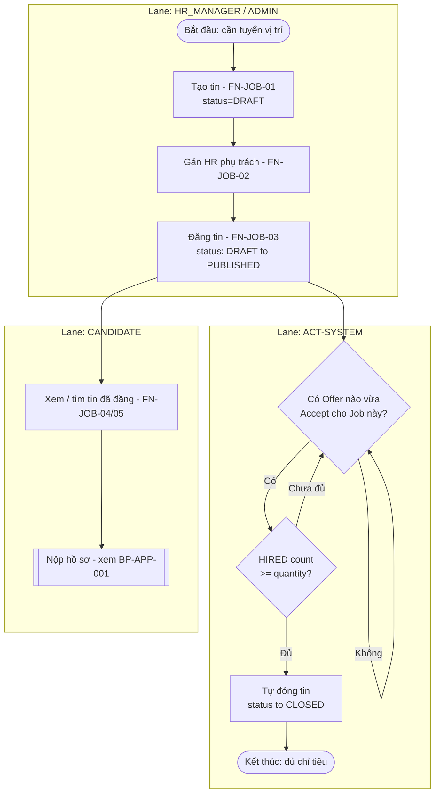
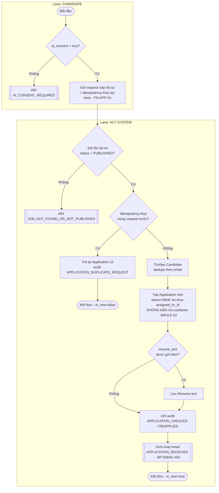
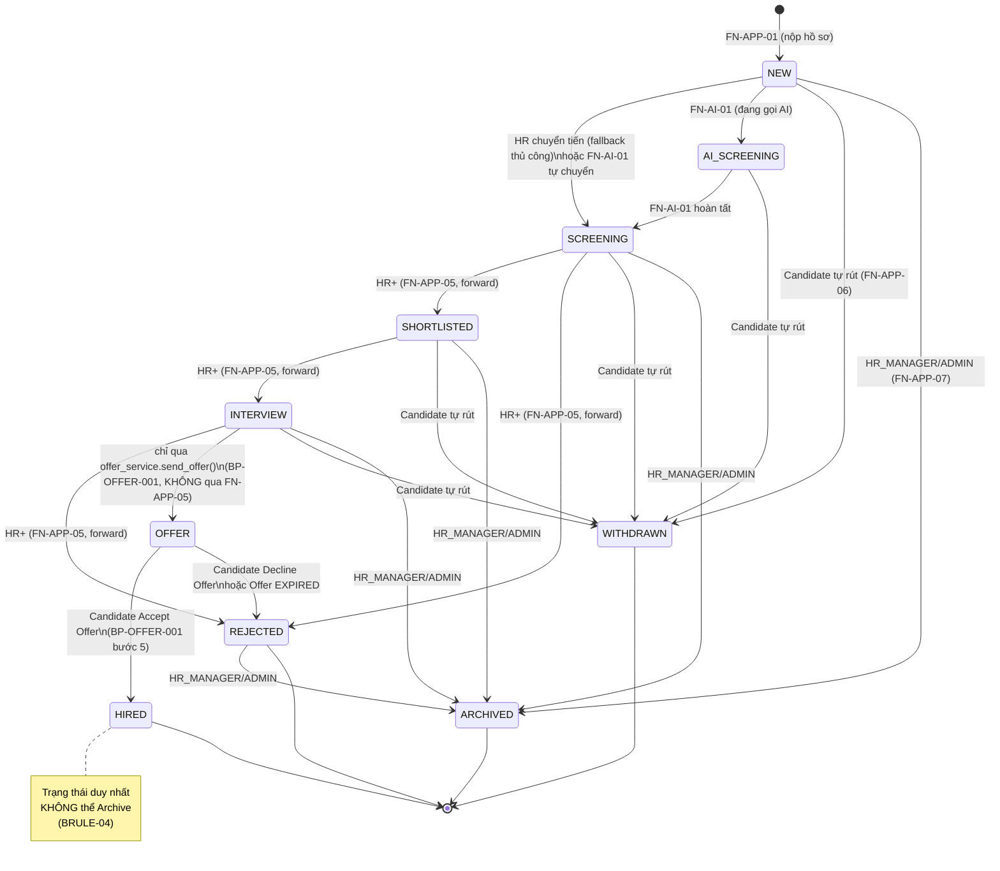
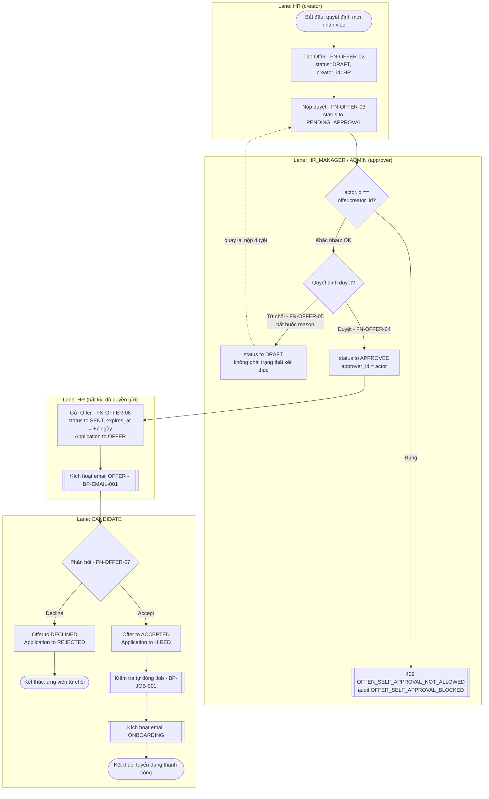
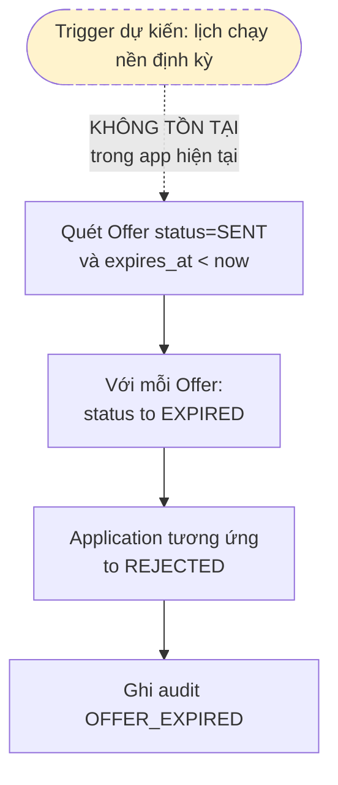
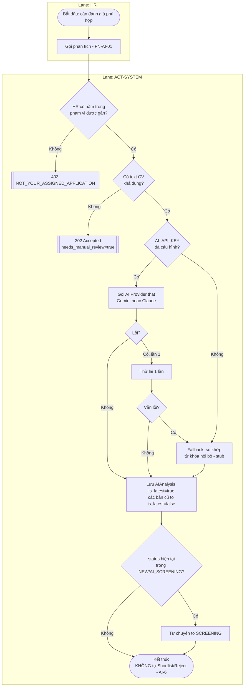
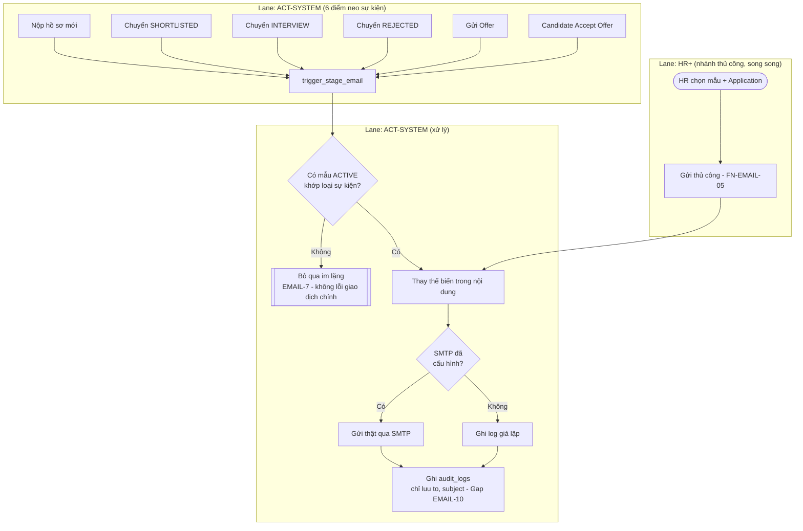

# 10 — BPMN DIAGRAMS (Mermaid) — ATS v2.1

**Ghi chú kỹ thuật**: Mermaid không có ký hiệu BPMN Pool/Lane hay Gateway chuẩn (◇). Tài liệu này dùng `flowchart` với `subgraph` để mô phỏng **Lane theo Actor**, hình thoi (`{...}`) mô phỏng **Exclusive Gateway**, và `stateDiagram-v2` cho các máy trạng thái đầy đủ. Toàn bộ nội dung sơ đồ bám sát đúng logic đã đặc tả bằng chữ ở `09_BUSINESS_PROCESS.md` — không thêm bước nào không có trong code.

---

## 10.1 BP-JOB-001 — Vòng đời tin tuyển dụng

## 10.2 BP-APP-001 — Ứng viên nộp hồ sơ (kể cả tái ứng tuyển)

## 10.3 BP-APP-002 — Máy trạng thái Application (đầy đủ 10 giá trị)

**Ghi chú đối chiếu code**: các cạnh lùi (VD `SHORTLISTED → SCREENING`) không vẽ riêng từng cạnh trong sơ đồ trên vì áp dụng đồng loạt theo `PIPELINE_ORDER` (bất kỳ cặp `(hiện tại, đích)` nào mà đích đứng trước hiện tại trong thứ tự `NEW→AI_SCREENING→SCREENING→SHORTLISTED→INTERVIEW→OFFER→HIRED` đều hợp lệ về mặt kỹ thuật, với điều kiện actor là HR_MANAGER/ADMIN và có `reason` — xem `09_BUSINESS_PROCESS.md` BP-APP-002). Đây là khác biệt so với BPMN chuẩn (thường vẽ tường minh từng cạnh) — chọn cách chú thích gộp để sơ đồ không bị rối bởi ~15 cạnh lùi khả dĩ.

## 10.4 BP-OFFER-001 — Quy trình Offer 4-eyes Approval

## 10.5 BP-OFFER-002 — Offer tự động hết hạn *(chưa được lịch hóa — Gap)*

## 10.6 BP-AI-001 — AI Screening (Graceful Degradation)

## 10.7 BP-EMAIL-001 — Email tự động theo giai đoạn

---

*Kết thúc Đợt 3 (`08_FUNCTIONAL_SPECIFICATION.md`, `09_BUSINESS_PROCESS.md`, `10_BPMN.md`). Tài liệu tiếp theo (Đợt 4): `11_USE_CASE.md`, `12_USE_CASE_SPECIFICATION.md`.*
