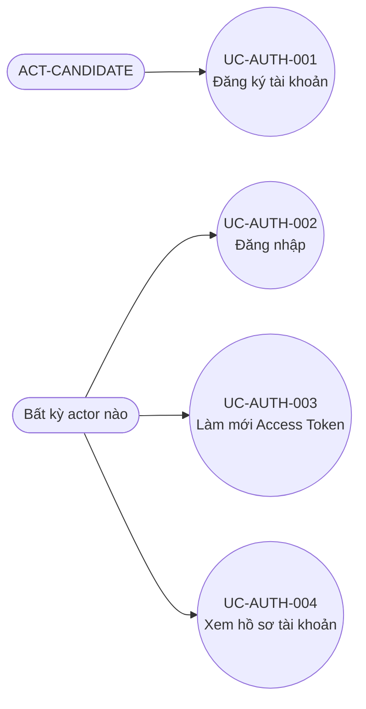
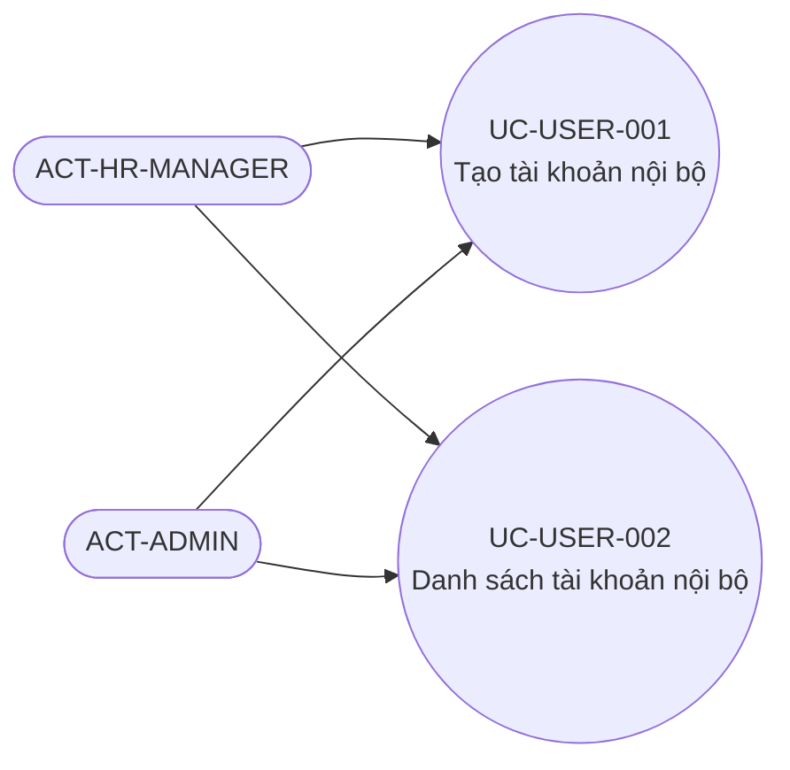
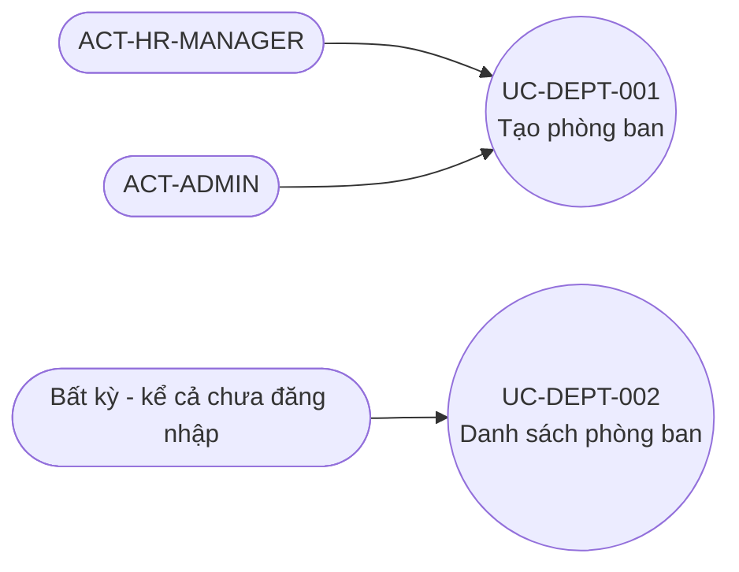
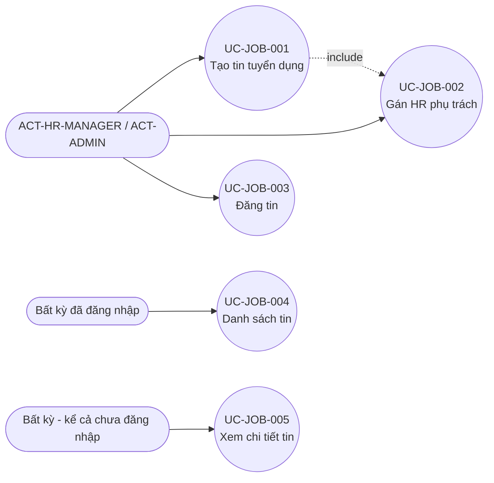
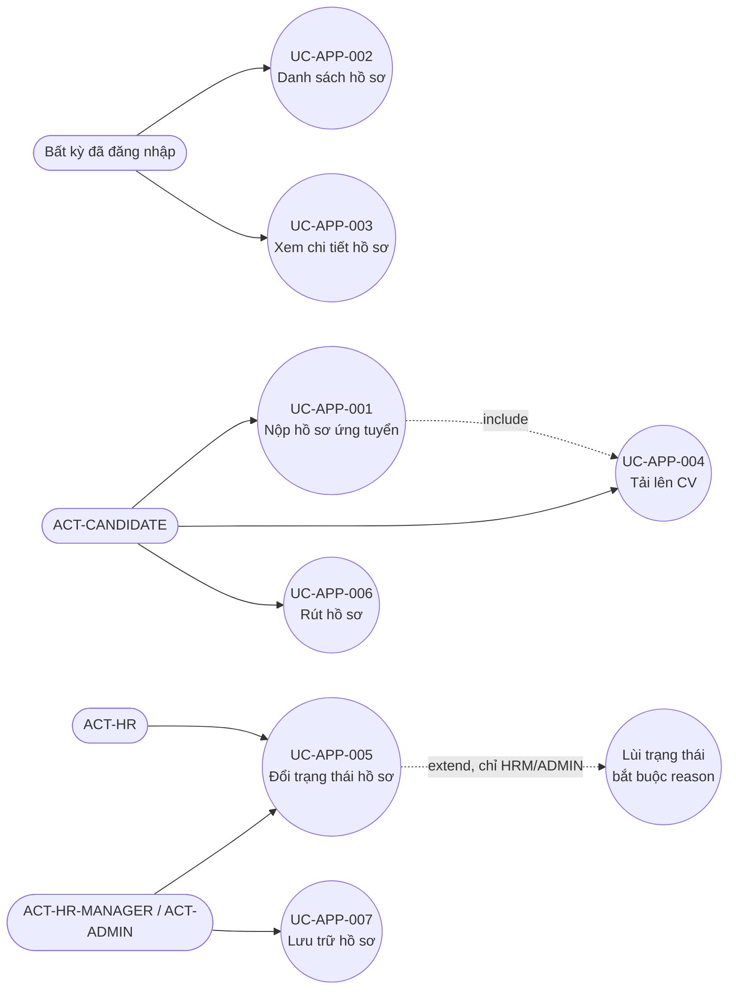
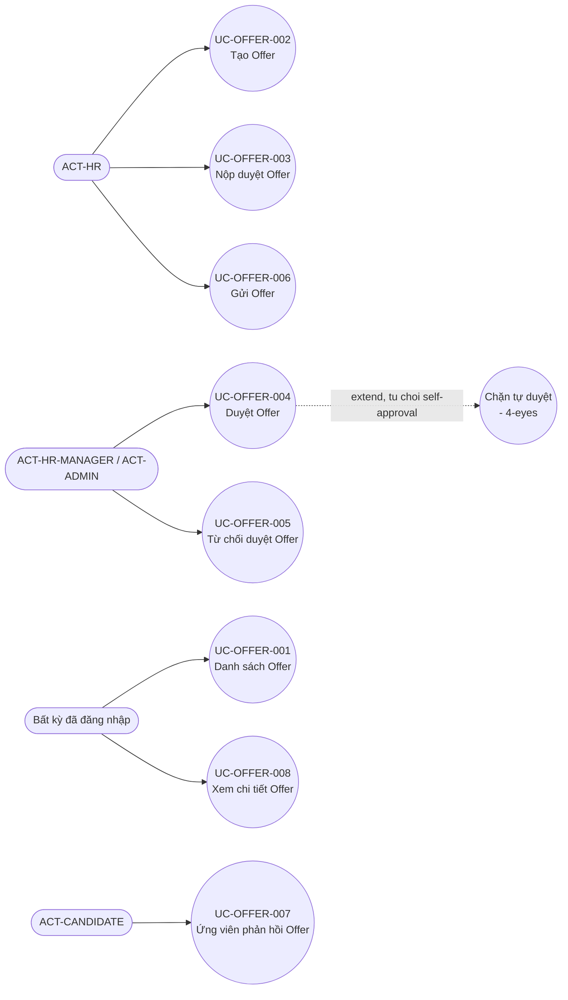
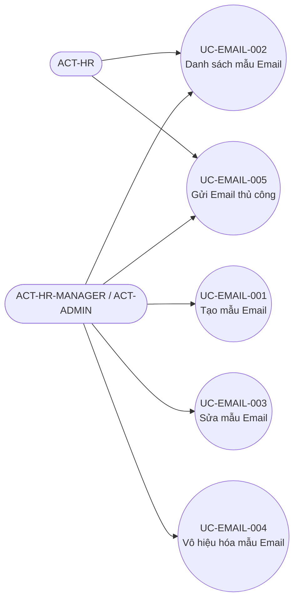
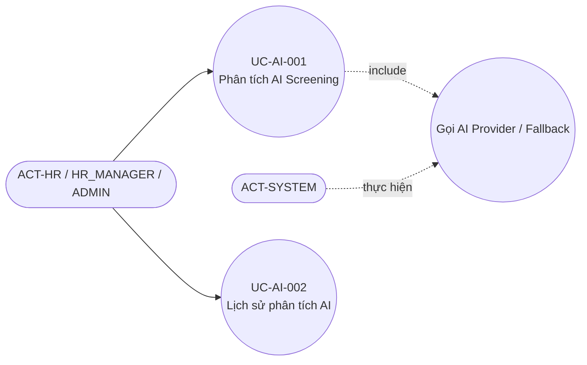
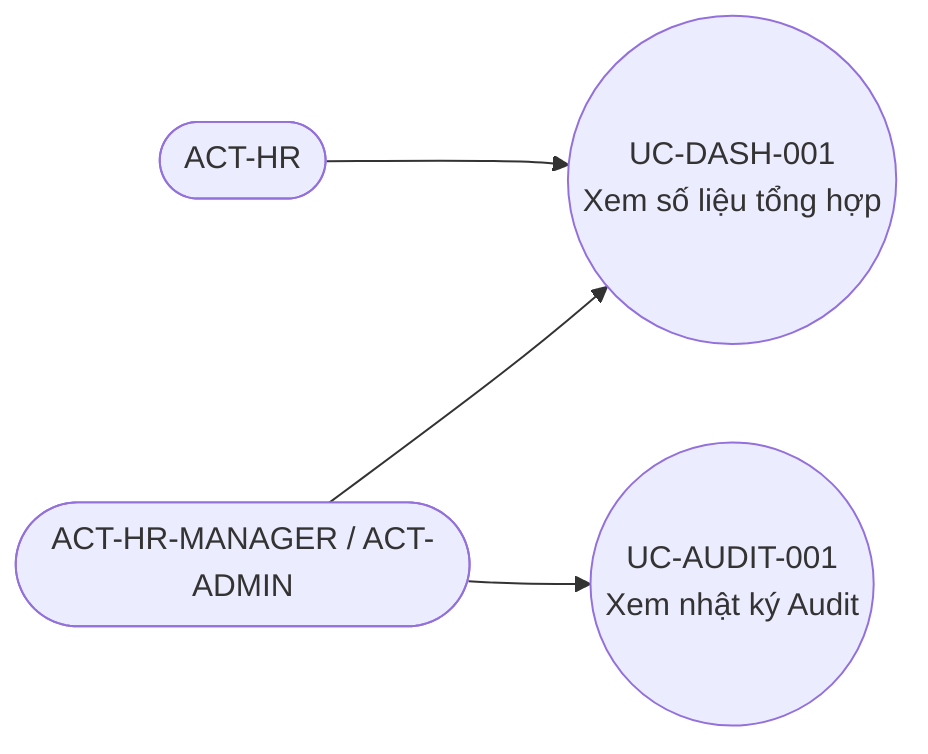

# 11 — USE CASE DIAGRAM — ATS v2.1

**Nguyên tắc đánh số**: Vì hệ thống được thiết kế thành tập hợp các thao tác API rời rạc (không có màn hình wizard nhiều bước gộp nhiều hành động thành 1 use case lớn), mỗi `UC-<MOD>-XXX` ở tài liệu này **ánh xạ 1:1** với đúng 1 `FN-<MOD>-XX` đã liệt kê ở `08_FUNCTIONAL_SPECIFICATION.md` — `[CONFIRMED — quyết định mô hình hóa]`, không phải bằng chứng trực tiếp từ code (code không có khái niệm "Use Case"), nhưng là cách ánh xạ trung thực nhất với hạt mịn (granularity) thật của hệ thống, tránh gộp giả tạo nhiều endpoint thành 1 UC không có căn cứ.

**Actor generalization**: `[CONFIRMED — KHÔNG áp dụng]`. `app/deps/rbac.py::require_roles()` luôn liệt kê tường minh danh sách role cho phép ở từng endpoint (VD `require_hr_or_above = {HR, HR_MANAGER, ADMIN}`), **không dùng cơ chế kế thừa vai trò** (không có `HR_MANAGER extends HR` trong code). Do đó sơ đồ dưới đây **không vẽ mũi tên generalization** giữa các actor — dù trực quan HR_MANAGER "có vẻ" bao hàm quyền của HR, đây là 2 tập quyền được liệt kê độc lập, tại nhiều endpoint không trùng nhau hoàn toàn (VD `GET /users` chỉ HR_MANAGER/ADMIN, HR không có, dù HR "thấp hơn" HR_MANAGER).

---

## 1. Danh sách Actor (nhắc lại Registry — `01_MASTER_DOCUMENT_OUTLINE.md` mục A.1)

`ACT-CANDIDATE`, `ACT-HR`, `ACT-HR-MANAGER`, `ACT-ADMIN`, `ACT-SYSTEM` (actor tự động — không tương tác qua UI, chỉ xuất hiện ở các UC có `<<include>>` từ 1 UC do người dùng khởi động).

## 2. Sơ đồ tổng quan theo Module (Mermaid flowchart mô phỏng Use Case Diagram)

### 2.1 MOD-AUTH

### 2.2 MOD-USER

### 2.3 MOD-DEPT

### 2.4 MOD-JOB

### 2.5 MOD-APP

### 2.6 MOD-OFFER

### 2.7 MOD-EMAIL

### 2.8 MOD-AI

### 2.9 MOD-DASH / MOD-AUDIT

## 3. Bảng tổng hợp toàn bộ 37 Use Case

| UC ID | Tên | Actor chính | Loại quan hệ | FN tương ứng | FR liên quan |
|---|---|---|---|---|---|
| UC-AUTH-001 | Đăng ký tài khoản | CANDIDATE | — | FN-AUTH-01 | FR-AUTH-001, FR-AUTH-002 |
| UC-AUTH-002 | Đăng nhập | Tất cả | — | FN-AUTH-02 | FR-AUTH-003, FR-AUTH-008 |
| UC-AUTH-003 | Làm mới Access Token | Tất cả | — | FN-AUTH-03 | FR-AUTH-006 |
| UC-AUTH-004 | Xem hồ sơ tài khoản | Tất cả | — | FN-AUTH-04 | FR-AUTH-007 |
| UC-USER-001 | Tạo tài khoản nội bộ | HR_MANAGER, ADMIN | — | FN-USER-01 | FR-USER-001..003 |
| UC-USER-002 | Danh sách tài khoản nội bộ | HR_MANAGER, ADMIN | — | FN-USER-02 | FR-USER-004 |
| UC-DEPT-001 | Tạo phòng ban | HR_MANAGER, ADMIN | — | FN-DEPT-01 | FR-DEPT-001 |
| UC-DEPT-002 | Danh sách phòng ban | Công khai | — | FN-DEPT-02 | FR-DEPT-002 |
| UC-JOB-001 | Tạo tin tuyển dụng | HR_MANAGER, ADMIN | `<<include>>` UC-JOB-002 (tùy chọn) | FN-JOB-01 | FR-JOB-001 |
| UC-JOB-002 | Gán HR phụ trách | HR_MANAGER, ADMIN | — | FN-JOB-02 | FR-JOB-002 |
| UC-JOB-003 | Đăng tin | HR_MANAGER, ADMIN | — | FN-JOB-03 | FR-JOB-003 |
| UC-JOB-004 | Danh sách tin | Đã đăng nhập | — | FN-JOB-04 | FR-JOB-004, FR-JOB-005 |
| UC-JOB-005 | Xem chi tiết tin | Công khai | — | FN-JOB-05 | FR-JOB-004 (không đầy đủ) |
| UC-APP-001 | Nộp hồ sơ ứng tuyển | CANDIDATE | `<<include>>` UC-APP-004 (tùy chọn) | FN-APP-01 | FR-APP-001..006 |
| UC-APP-002 | Danh sách hồ sơ | Đã đăng nhập | — | FN-APP-02 | FR-APP-015, FR-APP-017 |
| UC-APP-003 | Xem chi tiết hồ sơ | Đã đăng nhập | — | FN-APP-03 | FR-APP-015 (không đầy đủ) |
| UC-APP-004 | Tải lên CV | CANDIDATE | — | FN-APP-04 | FR-APP-007..009 |
| UC-APP-005 | Đổi trạng thái hồ sơ | HR, HR_MANAGER, ADMIN | `<<extend>>` Lùi trạng thái (chỉ HR_MANAGER/ADMIN) | FN-APP-05 | FR-APP-010..012 |
| UC-APP-006 | Rút hồ sơ | CANDIDATE | — | FN-APP-06 | FR-APP-013 |
| UC-APP-007 | Lưu trữ hồ sơ | HR_MANAGER, ADMIN | — | FN-APP-07 | FR-APP-014 |
| UC-OFFER-001 | Danh sách Offer | Đã đăng nhập | — | FN-OFFER-01 | FR-OFFER-012 |
| UC-OFFER-002 | Tạo Offer | HR+ | — | FN-OFFER-02 | FR-OFFER-001 |
| UC-OFFER-003 | Nộp duyệt Offer | HR+ | — | FN-OFFER-03 | FR-OFFER-002 |
| UC-OFFER-004 | Duyệt Offer | HR_MANAGER, ADMIN | `<<extend>>` Chặn tự duyệt (4-eyes) | FN-OFFER-04 | FR-OFFER-003, FR-OFFER-004 |
| UC-OFFER-005 | Từ chối duyệt Offer | HR_MANAGER, ADMIN | — | FN-OFFER-05 | FR-OFFER-005 |
| UC-OFFER-006 | Gửi Offer | HR+ | — | FN-OFFER-06 | FR-OFFER-006, FR-OFFER-007 |
| UC-OFFER-007 | Ứng viên phản hồi Offer | CANDIDATE | — | FN-OFFER-07 | FR-OFFER-008..010 |
| UC-OFFER-008 | Xem chi tiết Offer | Đã đăng nhập | — | FN-OFFER-08 | FR-OFFER-012 |
| UC-EMAIL-001 | Tạo mẫu Email | HR_MANAGER, ADMIN | — | FN-EMAIL-01 | FR-EMAIL-001, FR-EMAIL-003 |
| UC-EMAIL-002 | Danh sách mẫu Email | HR+ | — | FN-EMAIL-02 | FR-EMAIL-001 |
| UC-EMAIL-003 | Sửa mẫu Email | HR_MANAGER, ADMIN | — | FN-EMAIL-03 | FR-EMAIL-001 |
| UC-EMAIL-004 | Vô hiệu hóa mẫu Email | HR_MANAGER, ADMIN | — | FN-EMAIL-04 | FR-EMAIL-002 |
| UC-EMAIL-005 | Gửi Email thủ công | HR+ | — | FN-EMAIL-05 | FR-EMAIL-004/005/008/009 |
| UC-AI-001 | Phân tích AI Screening | HR+ | `<<include>>` Gọi AI Provider/Fallback (ACT-SYSTEM) | FN-AI-01 | FR-AI-001..006 |
| UC-AI-002 | Lịch sử phân tích AI | HR+ | — | FN-AI-02 | FR-AI-005 |
| UC-DASH-001 | Xem số liệu tổng hợp | HR+ | — | FN-DASH-01 | FR-DASH-001..004 |
| UC-AUDIT-001 | Xem nhật ký Audit | HR_MANAGER, ADMIN | — | FN-AUDIT-01 | FR-AUDIT-001..003 |

**Tổng**: 37 Use Case, khớp chính xác 1:1 với 37 Function ở `08`. Không có Use Case "hệ thống-only" độc lập (VD `BP-OFFER-002` Offer tự động hết hạn) — vì Use Case theo định nghĩa UML cổ điển đại diện cho tương tác giữa actor (bao gồm actor hệ thống) và hệ thống mang lại giá trị quan sát được; tiến trình `expire_due_offers()` **không có actor nào kích hoạt được** (không có endpoint, không có lịch chạy) nên không đủ điều kiện là 1 Use Case hoàn chỉnh — được ghi nhận là Gap, không phải Use Case.

---

*Tài liệu tiếp theo: `12_USE_CASE_SPECIFICATION.md` (đặc tả chi tiết cả 37 Use Case).*
