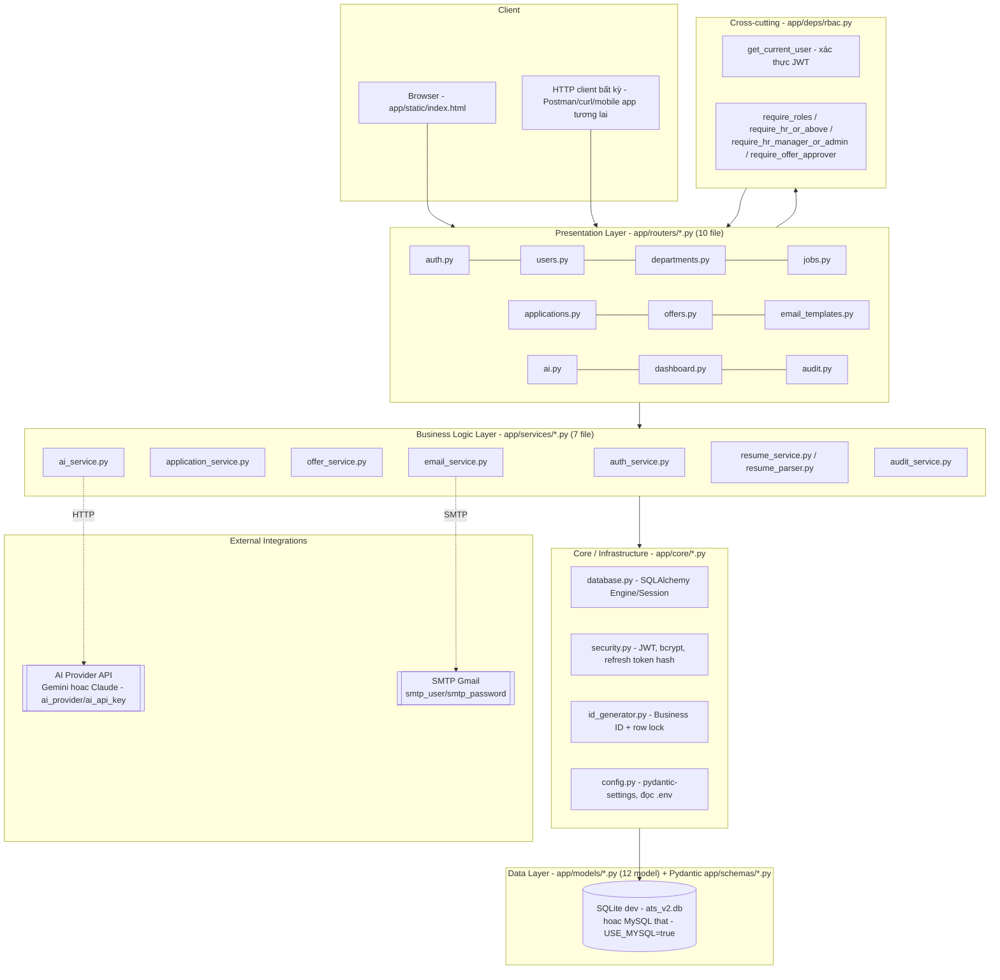

# 14 — SYSTEM ARCHITECTURE — ATS v2.1

**Nguồn**: `app/main.py`, `app/core/*.py`, cấu trúc thư mục `app/` (đọc trực tiếp), mở rộng mục 9 của `00_PROJECT_DISCOVERY.md`.

## 1. Kiểu kiến trúc tổng thể

`[CONFIRMED]` — **Monolith 1 tiến trình** (single process), kiến trúc phân lớp (Layered Architecture, lý thuyết ở `02_CO_SO_LY_THUYET.md` mục 1), phục vụ đồng thời:
- REST API (JSON, dưới các prefix `/auth`, `/users`, `/departments`, `/jobs`, `/applications`, `/offers`, `/email-templates`, `/ai`, `/dashboard`, `/audit`)
- 1 trang HTML tĩnh (`app/static/index.html`) mount tại `/` và `/static/*` — Single Page Application đơn giản (không có build step/bundler; JS/CSS nhúng trực tiếp hoặc file tĩnh riêng)

**Không có**: API Gateway, Load Balancer, Message Queue, Cache layer (Redis...), Service Mesh, hay bất kỳ thành phần hạ tầng phân tán nào — `[MISSING]`, phù hợp quy mô 1 instance dev/demo hiện tại (Assumption A-01 ở `05_BRD.md`).

## 2. Sơ đồ phân lớp (Layered Architecture chi tiết)

## 3. Vòng đời request điển hình (tổng quát — chi tiết hóa từng bước ở `18_GENERAL_WORKFLOW.md`)

`[CONFIRMED]`: `HTTP Request → FastAPI routing → Dependency Injection (get_db, get_current_user/require_*) → Router function (validate input qua Pydantic schema) → gọi Service function (business logic + DB write qua SQLAlchemy Session) → commit → trả response (Pydantic response_model) → JSON`.

Đặc điểm quan trọng: **Router không chứa business logic phức tạp** — với các module có quy tắc nghiệp vụ nhiều bước (Application, Offer, AI, Email), router chỉ làm nhiệm vụ parse input + gọi đúng 1 hàm service; toàn bộ state machine, kiểm tra 4-eyes, graceful degradation nằm trong `app/services/`. Ngoại lệ: `departments.py`, `dashboard.py` không có service riêng — logic đơn giản viết thẳng trong router (không đủ phức tạp để tách lớp).

## 4. Cấu hình & Quản lý biến môi trường

`[CONFIRMED]` — `app/core/config.py::Settings` (pydantic-settings, đọc `.env`), toàn bộ tham số:

| Nhóm | Biến | Mặc định | Ghi chú |
|---|---|---|---|
| Database | `database_url` (fallback), `use_mysql`, `mysql_user/password/host/port/db` | `sqlite:///./ats_v2.db` | **[CẬP NHẬT sau STEP 1]** MySQL đã tích hợp thật qua `USE_MYSQL=true` + `MYSQL_*`, tự động fallback về `database_url` (SQLite) nếu không kết nối được — xem mục 6 |
| JWT | `jwt_secret`, `jwt_access_token_hours` (8), `jwt_refresh_token_days` (30) | — | `jwt_secret` mặc định `"change-me-in-production"` — rủi ro nếu deploy thật mà quên đổi (`[CONFIRMED — điểm cần lưu ý]`, ghi vào Gap) |
| Nghiệp vụ | `offer_validity_days` (7), `ai_monthly_budget_cap_usd` (50.0, không có logic dùng — xem AI-7) | — | |
| URL công khai | `public_app_url`, `hr_app_url`, `api_url` | localhost | Không thấy nơi nào trong code đọc 3 biến này để redirect/CORS động — có khả năng dự phòng cho kiến trúc tách frontend/backend trong tương lai, hiện `[MISSING sử dụng thực tế]` |
| SMTP | `smtp_host`, `smtp_port`, `smtp_user`, `smtp_password`, `smtp_from_name`, `company_name` | Gmail smtp.gmail.com:587 | Để trống → `email_service` tự chuyển chế độ giả lập; **[CẬP NHẬT sau STEP 1]** đã cấu hình Gmail SMTP thật, kiểm chứng gửi thành công |
| AI | `ai_provider`, `ai_api_key`, `ai_model` | `"gemini"` / (trống) / (trống, dùng mặc định theo provider) | Để trống `ai_api_key` → `ai_service` tự chuyển chế độ stub. **[CẬP NHẬT sau STEP 1]** Tổng quát hóa từ field riêng cho Gemini (`gemini_api_key`/`gemini_model`) thành field trung lập theo provider; hiện cấu hình `ai_provider=claude` |

## 5. Tích hợp bên ngoài (External Integrations)

`[CONFIRMED]`:
- **AI Provider API** (`ai_service.py::_call_ai_provider` — dispatch tới `_call_gemini` hoặc `_call_claude` theo `settings.ai_provider`): gọi khi có `ai_api_key`; retry 1 lần khi lỗi; timeout/lỗi mạng → fallback stub. Không có circuit breaker, không có cache kết quả gọi trùng. Kiến trúc dùng 1 dict `PROVIDER_CALLERS` để dễ bổ sung nhà cung cấp mới (chỉ cần thêm 1 hàm `_call_<provider>()` + đăng ký vào dict, không sửa `run_screening()`).
- **SMTP (khuyến nghị Gmail App Password)** (`email_service.py::send_raw_email`): kết nối trực tiếp qua `smtplib`, không qua dịch vụ email trung gian (SES, SendGrid...).

Cả 2 tích hợp đều tuân theo pattern chung: **đọc cấu hình → nếu thiếu, tự chuyển chế độ mô phỏng, không throw lỗi chặn luồng chính** (Graceful Degradation, `02_CO_SO_LY_THUYET.md` mục 8).

## 6. Lưu trữ dữ liệu

`[CONFIRMED]` — **[CẬP NHẬT sau STEP 1]** Cả SQLite và MySQL hiện đều đã được xác nhận vận hành thật:
- SQLite (`ats_v2.db`, file cục bộ) — mặc định cho dev/test, dùng khi `USE_MYSQL=false` (mặc định) hoặc khi MySQL cấu hình mà không kết nối được (fallback tự động).
- MySQL — kích hoạt qua `USE_MYSQL=true` + `MYSQL_USER/PASSWORD/HOST/PORT/DB` (`app/core/database.py`), dùng driver `pymysql` (đã bổ sung vào `requirements.txt`). Đã kiểm chứng: tạo đúng 12 bảng qua `create_all()`, chạy trọn vẹn kịch bản E2E qua HTTP thật trên MySQL.
- `is_sqlite` (dùng bởi `id_generator.py` để quyết định có cần lớp khóa `threading.Lock` bổ sung hay không — SQLite không emit `FOR UPDATE` thật) được tính từ **dialect thực tế của engine đã khởi tạo**, không phải từ cấu hình tĩnh — đảm bảo đúng ngay cả khi xảy ra fallback MySQL→SQLite.
- Vẫn **`[MISSING]`**: không có migration script (Alembic) để đảm bảo schema nhất quán khi thay đổi model sau này — xem mục 7 và Gap G-TECH-01 (`20_GAP_ANALYSIS.md`).

## 7. Khởi tạo & Migration

`[CONFIRMED]` — `app/main.py::lifespan()` gọi `Base.metadata.create_all(bind=engine)` mỗi lần ứng dụng khởi động — tạo bảng nếu chưa tồn tại, **không có versioning schema** (không Alembic, dù comment trong code tự ghi nhận đây là "backlog trước khi lên production"). Rủi ro: thay đổi cấu trúc model sau này (thêm cột, đổi kiểu) sẽ **không tự động migrate** dữ liệu đã có — áp dụng cho cả `ats_v2.db` (SQLite) lẫn database MySQL đang cấu hình (`create_all()` chỉ tạo bảng còn thiếu, không sửa bảng đã tồn tại) — cần xử lý thủ công hoặc xóa/tạo lại DB.

## 8. Bảo mật tầng hạ tầng (Infrastructure-level Security)

`[CONFIRMED — điểm cần lưu ý]`:
- **CORS**: `allow_origins=["*"]` + `allow_credentials=True` cùng lúc — tổ hợp không hợp lệ theo chuẩn trình duyệt khi dùng cookie (đã ghi ở `06_SRS.md NFR-SEC-002`). Hiện chưa gây lỗi vì không dùng cookie-based session.
- **HTTPS/TLS**: không có cấu hình trong code (thường do reverse proxy đảm nhiệm khi deploy thật) — `[MISSING trong phạm vi code này]`, không phải lỗi thiết kế vì đây là trách nhiệm hạ tầng triển khai, không phải application code.
- **Secret quản lý**: `.env` (không commit — cần xác nhận `.gitignore`, xem Open Question OQ-03 ở `00`), giá trị mặc định `jwt_secret` không an toàn nếu quên đổi khi deploy.

## 9. Static File Serving & Frontend

`[CONFIRMED]` — `app/static/index.html` là 1 file HTML lớn (Tailwind qua CDN hoặc class utility, JS thuần nhúng trong `<script>`, gọi trực tiếp các endpoint REST bằng `fetch`), được FastAPI serve tĩnh qua `StaticFiles` + 1 route `GET /` trả về `index.html`. **Không có** SPA router phía client (không React Router/Vue Router) — điều hướng bằng cách ẩn/hiện section trong cùng 1 trang (kỹ thuật "single-page app thủ công", không dùng framework). Hai file `app/static/css/style.css` và `app/static/js/app.js` tồn tại nhưng **không được `index.html` tham chiếu** — Documentation Mismatch đã ghi ở `00` (OQ-02), nhắc lại ở đây vì thuộc phạm vi kiến trúc frontend.

## 10. Kiến trúc triển khai (Deployment) — `[MISSING bằng chứng]`

Không tìm thấy trong `ats-v2/`: Dockerfile, docker-compose, file cấu hình CI/CD (`.github/workflows`, `Jenkinsfile`...), file cấu hình reverse proxy (nginx.conf), hay bất kỳ tài liệu vận hành production nào. Sơ đồ Deployment Diagram đầy đủ (UML) do đó **không thể vẽ dựa trên bằng chứng** — xem `15_UML.md` mục Deployment, đánh dấu `[MISSING]` thay vì suy đoán một kiến trúc triển khai không có căn cứ (đúng RULE 1/RULE 5).

**Trạng thái vận hành thực tế duy nhất có bằng chứng**: chạy trực tiếp bằng `uvicorn app.main:app` trên 1 máy/container duy nhất, phục vụ cả API lẫn static frontend từ cùng 1 tiến trình, dùng file SQLite cục bộ.

---

*Tài liệu tiếp theo: `15_UML.md` (Class/Sequence/Component/Deployment Diagram).*
