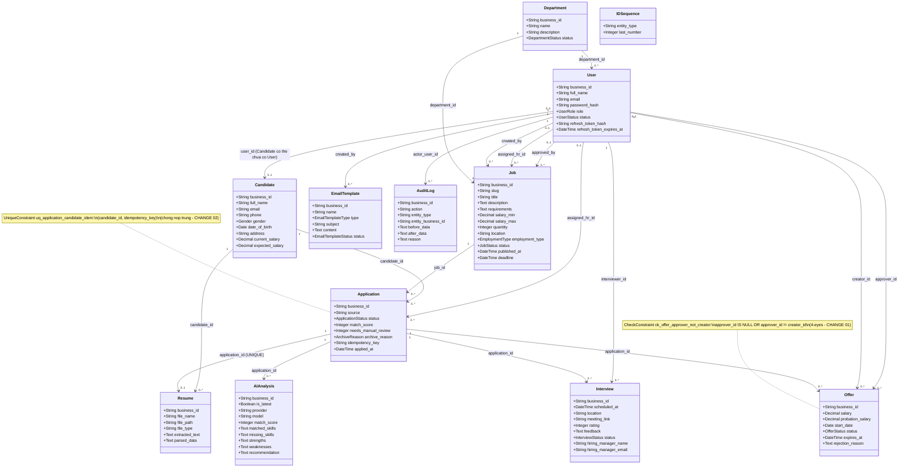
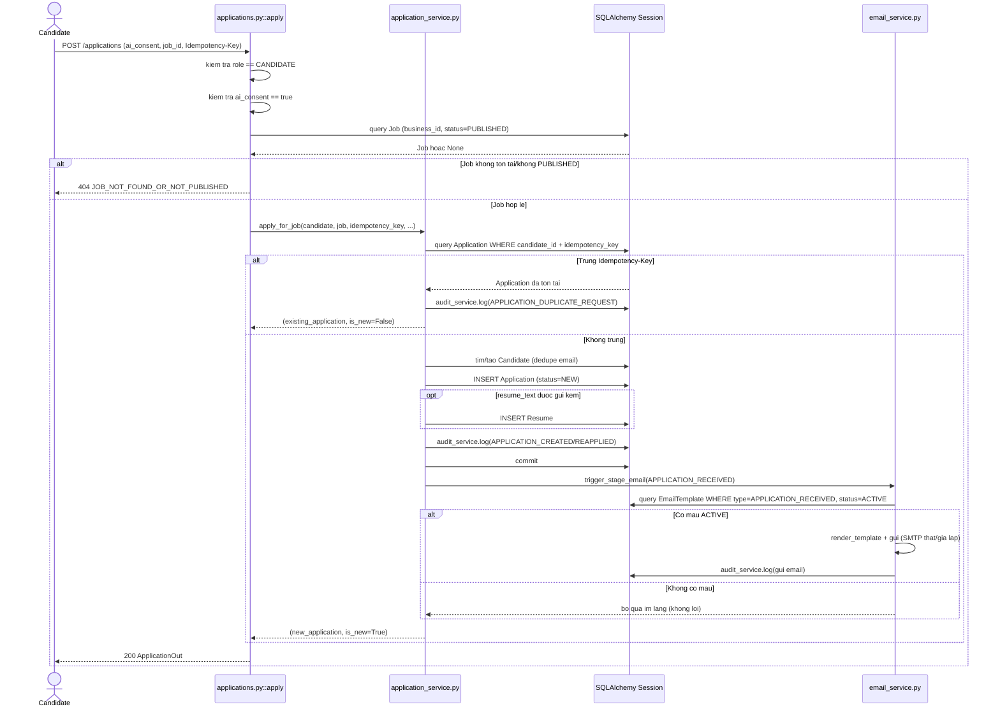
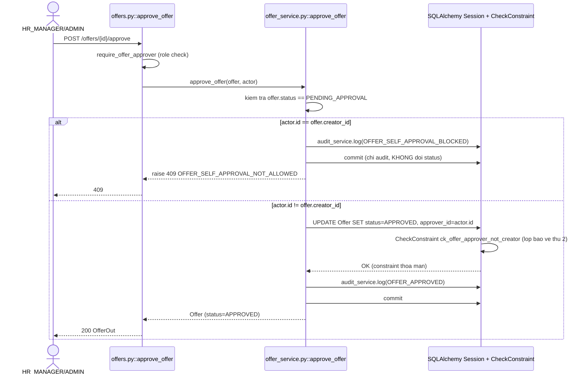
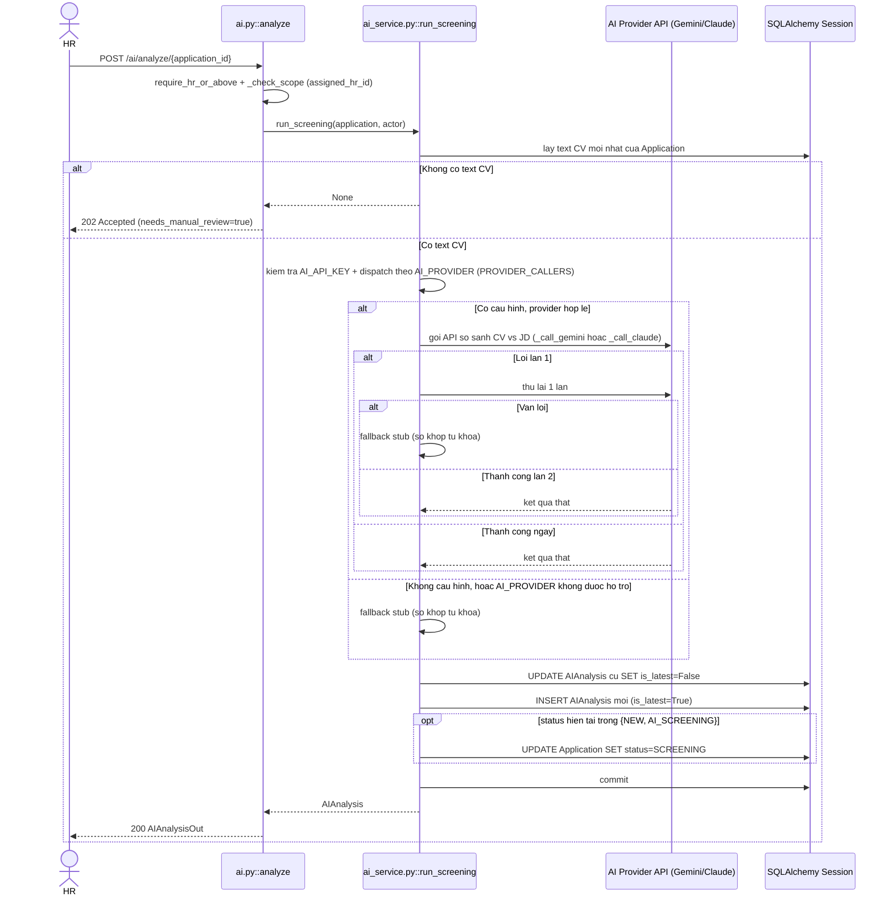
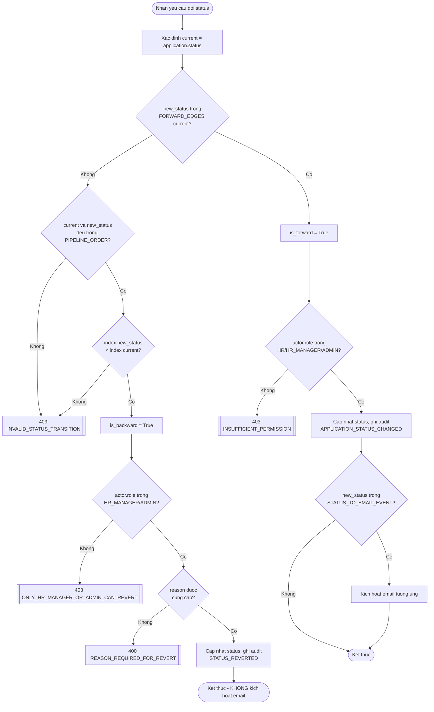
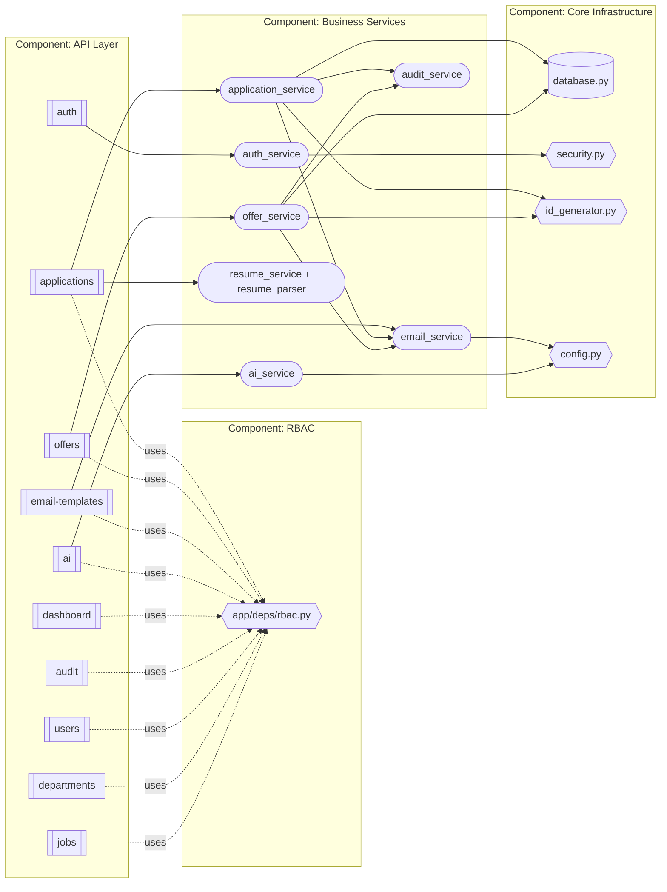
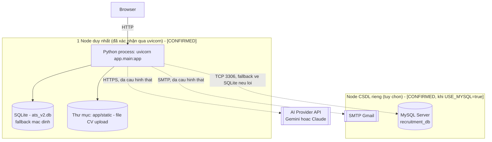

# 15 — UML DIAGRAMS — ATS v2.1

Gộp Class + Sequence + Activity + Component + Deployment Diagram theo đề xuất ở `01_MASTER_DOCUMENT_OUTLINE.md` mục B. Nguồn: `app/models/*.py` (12 file, đọc trực tiếp toàn bộ ở Đợt 5), `app/services/*.py`.

---

## 1. CLASS DIAGRAM

`[CONFIRMED]` — trích xuất trực tiếp từ SQLAlchemy model (không suy đoán thuộc tính). Không vẽ `id` (PK kỹ thuật nội bộ) trong diagram để đỡ rối — chỉ giữ `business_id` (định danh nghiệp vụ hiển thị, theo CHANGE 03).

**Quan hệ đáng chú ý phát hiện khi đọc code** (không tự nhiên thấy nếu chỉ đọc ERD):
- `User.department_id` là **tùy chọn** (`nullable=True` — không thấy trong code trích) — một User (kể cả HR/HR_MANAGER/ADMIN) có thể không gắn phòng ban.
- `Candidate.user_id` là **tùy chọn** (`nullable=True`) — về lý thuyết CSDL cho phép tồn tại `Candidate` không gắn `User` nào (dấu vết của khả năng "HR tạo hồ sơ Candidate hộ" được nhắc trong comment code `app/routers/applications.py` dòng dedupe, dù không có endpoint nào hiện thực việc HR tự tạo Candidate).
- `Job` có **3 quan hệ riêng biệt** tới `User` (`created_by`, `assigned_hr_id`, `approved_by`) — 3 vai trò khác nhau của "người tạo/người phụ trách/người duyệt" cùng trỏ vào 1 bảng `users`, không phải 3 bảng riêng.

## 2. SEQUENCE DIAGRAM

### 2.1 UC-APP-001 — Nộp hồ sơ ứng tuyển (kèm nhánh Idempotency)

### 2.2 UC-OFFER-004 — Duyệt Offer (4-eyes approval)

### 2.3 UC-AI-001 — Phân tích AI Screening (Graceful Degradation)

## 3. ACTIVITY DIAGRAM — Thuật toán xác thực chuyển trạng thái Application (`update_status`)

`[CONFIRMED]` — mô tả chi tiết thuật toán bên trong `application_service.py::update_status` (bổ sung góc nhìn "activity/thuật toán" cho phần đã mô tả bằng state machine ở `10_BPMN.md` mục 10.3):

## 4. COMPONENT DIAGRAM

`[CONFIRMED]` — mở rộng góc nhìn thành phần từ `14_SYSTEM_ARCHITECTURE.md` mục 2, tập trung vào interface giữa các thành phần:

## 5. DEPLOYMENT DIAGRAM — `[MISSING]`

`[CONFIRMED — không đủ bằng chứng để vẽ]`. Như đã nêu ở `14_SYSTEM_ARCHITECTURE.md` mục 10, `ats-v2/` không chứa Dockerfile, file compose, cấu hình CI/CD, hay tài liệu vận hành production. Vẽ 1 Deployment Diagram đầy đủ (node, artifact, giao thức mạng giữa các node) tại thời điểm này sẽ là **suy đoán không có căn cứ**, vi phạm RULE 1 và RULE 5. Thay vào đó, ghi nhận trạng thái triển khai **duy nhất có bằng chứng**:

**[CẬP NHẬT sau STEP 1]** Khác với nhận định ban đầu ("chưa cấu hình"), cả AI Provider và SMTP hiện đã được cấu hình bằng credential thật và kiểm chứng hoạt động; MySQL cũng đã được thêm như 1 lựa chọn triển khai CSDL thật (không còn chỉ là SQLite). Đây vẫn là mô tả trạng thái **1 node duy nhất chạy `uvicorn`** cục bộ — chưa có bằng chứng triển khai multi-node/container hóa thật (giữ nguyên đánh giá `[MISSING]` cho Deployment Diagram production đầy đủ).

Đây được ghi nhận là Gap ở `20_GAP_ANALYSIS.md` (Deployment Diagram không thể hoàn thiện do thiếu bằng chứng hạ tầng), không phải một sơ đồ triển khai production thật.

---

*Kết thúc Đợt 5 (`13_SYSTEM_MODELING.md`, `14_SYSTEM_ARCHITECTURE.md`, `15_UML.md`). Tài liệu tiếp theo (Đợt 6): `16_DATABASE_DESIGN.md`, `17_TECHNOLOGY_STACK.md`, `18_GENERAL_WORKFLOW.md`.*
