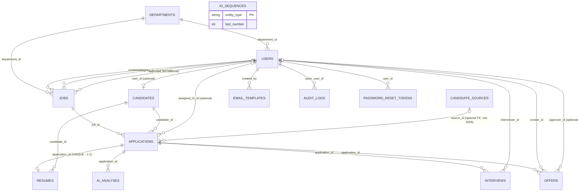

# 16 — DATABASE DESIGN (ERD + DATA DICTIONARY + TABLE SPECIFICATION) — ATS v2

> **REFRESH TOÀN DIỆN 2026-08-18** (ngoài phạm vi 23-file gốc). Dựng lại từ đầu bằng cách đọc trực tiếp **14 file** trong `app/models/*.py` (tăng từ 12 file/12 bảng ở bản gốc 2026-08-14) — thêm `candidate_sources.py`, `password_reset_token.py`. Đồng thời verify trực tiếp trên DB MySQL dev thật đang chạy (`SELECT` qua `Base.metadata.tables.keys()`, không chỉ đọc code) — xác nhận đúng 14 bảng khớp với model.

**Nguồn**: `app/models/*.py` (14 file). **Engine đã xác nhận vận hành thật**: SQLite (dev/test mặc định) **và MySQL** (`USE_MYSQL=true`, đã kiểm chứng chạy schema + dữ liệu thật trên `recruitment_db`, xem `21_OPEN_QUESTIONS.md` OQ-05). Không có Alembic — schema tạo bởi `Base.metadata.create_all()` lúc khởi động; các thay đổi schema sau khi bảng đã tồn tại (thêm cột/index trên DB đã có dữ liệu) dùng script migration thủ công idempotent riêng (`scripts/migrate_v2_2.py`, `scripts/migrate_v2_3.py`) — xem mục 5.

## 1. ERD (Entity Relationship Diagram)

**Ghi chú đọc sơ đồ**: `ID_SEQUENCES` không có quan hệ FK — bảng đếm kỹ thuật độc lập dùng bởi `app/core/id_generator.py` để sinh `business_id` an toàn với truy cập đồng thời (row lock). `PASSWORD_RESET_TOKENS` (mới) cũng là bảng kỹ thuật/bảo mật nội bộ — **không có `business_id`** (không phải thực thể nghiệp vụ hiển thị qua UI/URL, chỉ token hash tạm thời).

## 2. Danh sách bảng (14 bảng — `[CONFIRMED]`, verify trực tiếp trên MySQL dev 2026-08-18, tăng 2 so với bản gốc)

| # | Bảng | Mục đích | Số cột | PK | Business ID prefix |
|---|---|---|---|---|---|
| 1 | `departments` | Phòng ban | 6 | `id` | `DEP` |
| 2 | `users` | Tài khoản (cả 4 vai trò, kể cả Candidate) | 12 | `id` | `USR` |
| 3 | `jobs` | Tin tuyển dụng | 17 | `id` | `JOB` |
| 4 | `candidates` | Hồ sơ ứng viên (thông tin cá nhân) | 12 | `id` | `UV` |
| 5 | `applications` | Hồ sơ ứng tuyển (1 lần nộp) | 15 *(+2 so với bản gốc — `source_id`, giữ nguyên `source`)* | `id` | `APP` |
| 6 | `resumes` | File CV / text CV | 9 | `id` | `CV` |
| 7 | `ai_analyses` | Kết quả phân tích AI | 13 | `id` | `AI` |
| 8 | `interviews` | Lịch/kết quả phỏng vấn | 14 | `id` | `INT` |
| 9 | `offers` | Thư mời nhận việc | 15 | `id` | `OFF` |
| 10 | `email_templates` | Mẫu Email | 9 | `id` | `EMT` |
| 11 | `audit_logs` | Nhật ký audit | 9 | `id` | `AUD` |
| 12 | `candidate_sources` *(mới)* | System Configuration — danh mục "Nguồn hồ sơ" | 6 | `id` | `SRC` |
| 13 | `password_reset_tokens` *(mới)* | Token đặt lại mật khẩu (bảo mật nội bộ) | 6 | `id` | *(không có — không phải thực thể nghiệp vụ)* |
| 14 | `id_sequences` | Bộ đếm sinh Business ID | 2 | `entity_type` | (không áp dụng — bảng kỹ thuật) |

## 3. Data Dictionary chi tiết

### 3.1 `departments`

| Cột | Kiểu | Null | Default | Ràng buộc | Mô tả |
|---|---|---|---|---|---|
| `id` | Integer | No | auto | PK | Khóa kỹ thuật nội bộ |
| `business_id` | String(20) | No | — | UNIQUE, INDEX | `DEP0001`... |
| `name` | String(100) | No | — | UNIQUE | Tên phòng ban |
| `description` | Text | Yes | — | — | Mô tả |
| `status` | Enum(`DepartmentStatus`) | No | `ACTIVE` | — | `ACTIVE`/`INACTIVE` — nay **có** endpoint ghi `INACTIVE` (`PUT/DELETE /departments/{id}`, xây sau 2026-08-14) |
| `created_at`/`updated_at` | DateTime | No | now() | — | |

### 3.2 `users`

| Cột | Kiểu | Null | Default | Ràng buộc | Mô tả |
|---|---|---|---|---|---|
| `id` | Integer | No | auto | PK | |
| `business_id` | String(20) | No | — | UNIQUE, INDEX | `USR0001`... |
| `full_name` | String(100) | No | — | — | |
| `email` | String(120) | No | — | UNIQUE, INDEX | Dùng để đăng nhập |
| `phone` | String(20) | Yes | — | — | |
| `password_hash` | String(255) | No | — | — | **bcrypt** (`passlib.CryptContext`) — người dùng có yêu cầu đổi sang lưu plaintext 2026-08-18, đã **từ chối** vì lý do bảo mật (OWASP Cryptographic Failures), giữ nguyên bcrypt |
| `role` | Enum(`UserRole`) | No | — | — | `CANDIDATE`/`HR`/`HR_MANAGER`/`ADMIN` |
| `department_id` | Integer | Yes | — | FK→`departments.id` | Tùy chọn |
| `status` | Enum(`UserStatus`) | No | `ACTIVE` | — | `ACTIVE`/`INACTIVE`/`LOCKED` — nay **có** endpoint set `INACTIVE` (`DELETE /users/{id}`, soft-delete, xây sau 2026-08-14); `LOCKED` vẫn không route nào set |
| `refresh_token_hash` | String(255) | Yes | — | — | SHA-256 |
| `refresh_token_expires_at` | DateTime | Yes | — | — | |
| `created_at`/`updated_at` | DateTime | No | now() | — | |

### 3.3 `jobs`

| Cột | Kiểu | Null | Default | Ràng buộc | Mô tả |
|---|---|---|---|---|---|
| `id` | Integer | No | auto | PK | |
| `business_id` | String(20) | No | — | UNIQUE, INDEX | `JOB0001`... |
| `slug` | String(160) | Yes | — | UNIQUE, INDEX | Sinh tự động, vẫn không route nào dùng để truy vấn (JOB-7, không đổi) |
| `title` | String(150) | No | — | — | |
| `department_id` | Integer | No | — | FK→`departments.id`, **INDEX** *(bổ sung 2026-08-18, xem mục 5)* | |
| `description` | Text | No | — | — | |
| `requirements` | Text | No | — | — | |
| `salary_min`/`salary_max` | Numeric(12,2) | Yes | — | — | |
| `quantity` | Integer | No | 1 | — | |
| `location` | String(150) | No | — | — | |
| `employment_type` | Enum(`EmploymentType`) | No | — | — | |
| `status` | Enum(`JobStatus`) | No | `DRAFT` | **INDEX** *(bổ sung 2026-08-18)* | Vẫn chỉ `DRAFT`/`PUBLISHED`/`CLOSED` dùng thực tế (JOB-8, không đổi) |
| `created_by` | Integer | No | — | FK→`users.id` | |
| `assigned_hr_id` | Integer | Yes | — | FK→`users.id` | |
| `approved_by` | Integer | Yes | — | FK→`users.id` | |
| `published_at`/`deadline` | DateTime | Yes | — | — | `published_at` nay **được ghi thật** lúc `POST /jobs/{id}/publish` (trước đó chỉ khai báo cột, không gán giá trị — đã xác nhận sửa ở lượt làm việc V2.3) |
| `created_at`/`updated_at` | DateTime | No | now() | — | |

### 3.4 `candidates`

| Cột | Kiểu | Null | Default | Ràng buộc | Mô tả |
|---|---|---|---|---|---|
| `id` | Integer | No | auto | PK | |
| `business_id` | String(20) | No | — | UNIQUE, INDEX | `UV0001`... |
| `user_id` | Integer | Yes | — | FK→`users.id` | Tùy chọn (HR có thể tạo Candidate chưa từng đăng ký tài khoản, qua `POST /candidates`) |
| `full_name` | String(100) | No | — | — | |
| `email` | String(120) | No | — | UNIQUE, INDEX | Dùng để dedupe |
| `phone` | String(20) | No | — | — | |
| `gender` | Enum(`Gender`) | Yes | — | — | **Nay CÓ endpoint ghi** (`CandidateCreateRequest`/`CandidateUpdateRequest`, qua `POST`/`PUT /candidates`) — đã sửa từ bản gốc |
| `date_of_birth` | Date | Yes | — | — | Vẫn **không có endpoint ghi** (chưa sửa) |
| `address` | String(255) | Yes | — | — | Vẫn **không có endpoint ghi** (chưa sửa) |
| `current_salary`/`expected_salary` | Numeric(12,2) | Yes | — | — | Vẫn **không có endpoint ghi** — lưu ý: `Application.desired_salary` (bảng khác) mới thực sự được dùng cho "Lương mong muốn" trên UI, 2 cột này ở `candidates` là dữ liệu chết riêng biệt, dễ nhầm lẫn tên gọi |
| `skills_summary`/`experience_summary` | Text | Yes | — | — | *(2 cột này có trong model từ bản gốc, đã ghi được qua `CandidateCreateRequest`/`CandidateUpdateRequest`/Apply — không đổi)* |
| `status` | Enum(`CandidateStatus`) | No | `ACTIVE` | — | |
| `created_at`/`updated_at` | DateTime | No | now() | — | |

### 3.5 `applications`

| Cột | Kiểu | Null | Default | Ràng buộc | Mô tả |
|---|---|---|---|---|---|
| `id` | Integer | No | auto | PK | |
| `business_id` | String(20) | No | — | UNIQUE, INDEX | `APP0001`... |
| `candidate_id` | Integer | No | — | FK→`candidates.id`, **INDEX** *(bổ sung 2026-08-18)* | |
| `job_id` | Integer | No | — | FK→`jobs.id`, **INDEX** *(bổ sung 2026-08-18)* | |
| `department_id` | Integer | Yes | — | FK→`departments.id` | Kế thừa từ `Job.department_id` lúc tạo |
| `desired_salary` | Numeric(12,2) | Yes | — | — | "Lương mong muốn" thật sự dùng trên UI (khác `candidates.current_salary/expected_salary` — xem ghi chú ở 3.4) |
| `source_id` *(mới)* | Integer | Yes | — | FK→`candidate_sources.id`, **INDEX** | Tham chiếu **thật** tới danh mục Nguồn hồ sơ — cho phép đổi tên/vô hiệu hóa nguồn mà không mất liên kết báo cáo. `NULL` cho Application tạo trước khi có tính năng này |
| `source` | String(100) *(mở rộng từ 50, chỉ áp dụng MySQL — SQLite không enforce độ dài)* | Yes | — | — | **Snapshot text** tên nguồn tại thời điểm nộp đơn — giữ nguyên dù `candidate_sources.name` sau này đổi (yêu cầu nghiệp vụ: báo cáo lịch sử không được đổi ngược thời gian) |
| `status` | Enum(`ApplicationStatus`) | No | `NEW` | **INDEX** *(bổ sung 2026-08-18)* | |
| `match_score` | Integer | Yes | — | — | Vẫn không được ghi (đọc từ `AIAnalysis.match_score` mới nhất qua relationship) — không đổi, Gap còn tồn tại |
| `assigned_hr_id` | Integer | Yes | — | FK→`users.id` | |
| `needs_manual_review` | Integer (0/1) | No | 0 | — | Vẫn khác kiểu với `ai_analyses.is_latest` (Boolean) — Gap không đổi |
| `archive_reason` | Enum(`ArchiveReason`) | Yes | — | — | |
| `idempotency_key` | String(100) | Yes | — | INDEX | |
| `applied_at`/`updated_at` | DateTime | No | now() | — | |
| **Constraint bảng** | | | | `UNIQUE(candidate_id, idempotency_key)` | Không đổi |

### 3.6 `resumes`

| Cột | Kiểu | Null | Default | Ràng buộc | Mô tả |
|---|---|---|---|---|---|
| `id` | Integer | No | auto | PK | |
| `business_id` | String(20) | No | — | UNIQUE, INDEX | `CV0001`... |
| `candidate_id` | Integer | No | — | FK→`candidates.id`, **INDEX** *(bổ sung 2026-08-18)* | |
| `application_id` | Integer | No | — | FK→`applications.id`, **UNIQUE** | 1:1 |
| `file_name` | String(255) | No | — | — | |
| `file_path` | String(255) | No | — | — | |
| `file_type` | String(50) | No | — | — | |
| `extracted_text` | Text | Yes | — | — | |
| `parsed_data` | Text | Yes | — | — | Vẫn không có code nào ghi (không đổi) |
| `uploaded_at` | DateTime | No | now() | — | Nay expose qua `GET /applications/{id}/resume` (mới) — trước đó không có endpoint đọc riêng trường này |

**`[CONFIRMED — MỚI 2026-08-18]`**: `GET /resumes/{business_id}/download` (`app/routers/resumes.py`, module hoàn toàn mới) tải file thật (`FileResponse`) — trước đây chỉ đọc được `extracted_text` (text đã trích xuất) qua API, không tải được file gốc.

### 3.7 `ai_analyses`

*(không đổi so với bản gốc — xem bản gốc 2026-08-14 trong lịch sử Git nếu cần, nội dung giữ nguyên)*

| Cột | Kiểu | Null | Default | Ràng buộc | Mô tả |
|---|---|---|---|---|---|
| `id` | Integer | No | auto | PK | |
| `business_id` | String(20) | No | — | UNIQUE, INDEX | `AI0001`... |
| `application_id` | Integer | No | — | FK→`applications.id`, INDEX | |
| `is_latest` | Boolean | No | `True` | — | |
| `provider`/`model` | String(50) | No | — | — | Xác nhận gọi thật thành công 2026-08-18: `provider="gemini"`, `model="gemini-3.7-flash"` (model cấu hình qua `AI_MODEL`, không phải giá trị mặc định cứng) |
| `match_score` | Integer | No | — | — | |
| `matched_skills`/`missing_skills`/`strengths`/`weaknesses`/`experience_summary`/`recommendation` | Text | Yes | — | — | |
| `analysis_result` | Text | Yes | — | — | |
| `created_at` | DateTime | No | now() | — | |

### 3.8 `interviews`

| Cột | Kiểu | Null | Default | Ràng buộc | Mô tả |
|---|---|---|---|---|---|
| `id` | Integer | No | auto | PK | |
| `business_id` | String(20) | No | — | UNIQUE, INDEX | `INT0001`... |
| `application_id` | Integer | No | — | FK→`applications.id` | |
| `interviewer_id` | Integer | No | — | FK→`users.id` | |
| `scheduled_at`/`end_time` | DateTime | No | — | — | |
| `interview_type` | Enum | No | — | — | |
| `location`/`meeting_link` | String(255) | Yes | — | — | |
| `notes`/`feedback` | Text | Yes | — | — | |
| `rating` | Integer | Yes | — | — | |
| `status` | Enum(`InterviewStatus`) | No | `SCHEDULED` | — | `SCHEDULED`/`COMPLETED`/`CANCELLED` |
| `hiring_manager_name`/`hiring_manager_email`/`hiring_manager_feedback` | String/Text | Yes | — | — | |
| `created_at`/`updated_at` | DateTime | No | now() | — | |

**`[CONFIRMED — ĐÃ SỬA so với bản gốc 2026-08-14]`**: bản gốc đánh dấu bảng này `[MISSING API]` (schema tồn tại nhưng không có router). Nay **đã có** `app/routers/interview.py` với 6 endpoint CRUD đầy đủ (xem `07_USER_ROLE_PERMISSION.md` mục 3.8) — APP-20 Gap đã đóng.

### 3.9 `offers`

*(không đổi so với bản gốc)*

| Cột | Kiểu | Null | Default | Ràng buộc | Mô tả |
|---|---|---|---|---|---|
| `id` | Integer | No | auto | PK | |
| `business_id` | String(20) | No | — | UNIQUE, INDEX | `OFF0001`... |
| `application_id` | Integer | No | — | FK→`applications.id` | |
| `creator_id` | Integer | No | — | FK→`users.id` | |
| `approver_id` | Integer | Yes | — | FK→`users.id` | |
| `salary`/`probation_salary` | Numeric(12,2) | No | — | — | |
| `start_date` | Date | No | — | — | |
| `offer_file` | String(255) | Yes | — | — | Vẫn không có endpoint upload (chưa đổi) |
| `status` | Enum(`OfferStatus`) | No | `DRAFT` | — | |
| Các mốc thời gian (`created_at`...`responded_at`) | DateTime | Yes/No | — | — | |
| `rejection_reason` | Text | Yes | — | — | |
| **Constraint bảng** | | | | `CHECK(approver_id IS NULL OR approver_id != creator_id)` | 4-eyes ở tầng DB — không đổi |

### 3.10 `email_templates`

| Cột | Kiểu | Null | Default | Ràng buộc | Mô tả |
|---|---|---|---|---|---|
| `id` | Integer | No | auto | PK | |
| `business_id` | String(20) | No | — | UNIQUE, INDEX | `EMT0001`... |
| `name` | String(100) | No | — | — | Nay có kiểm tra **trùng tên** ở tầng service (`409 TEMPLATE_NAME_ALREADY_EXISTS`), không phải UNIQUE constraint ở tầng DB — bổ sung 2026-08-18 |
| `type` | Enum(`EmailTemplateType`) | No | — | — | **8 giá trị** (tăng từ 7) — bổ sung `PASSWORD_RESET` 2026-08-18 để vá bug Forgot Password câm lặng (xem `20_GAP_ANALYSIS.md` AUTH-9) |
| `subject` | String(255) | No | — | — | |
| `content` | Text | No | — | — | |
| `status` | Enum(`EmailTemplateStatus`) | No | `ACTIVE` | — | |
| `created_by` | Integer | No | — | FK→`users.id` | |
| `created_at`/`updated_at` | DateTime | No | now() | — | |

### 3.11 `audit_logs`

*(không đổi so với bản gốc)*

| Cột | Kiểu | Null | Default | Ràng buộc | Mô tả |
|---|---|---|---|---|---|
| `id` | Integer | No | auto | PK | |
| `business_id` | String(20) | No | — | UNIQUE, INDEX | `AUD0001`... |
| `actor_user_id` | Integer | No | — | FK→`users.id` | |
| `action` | String(50) | No | — | — | Chuỗi tự do — tăng thêm nhiều action mới (`EMAIL_TEMPLATE_CREATED/UPDATED/DELETED`, `PASSWORD_RESET_REQUESTED/COMPLETED`, `SOURCE_CREATED/UPDATED/DELETED`, `AI_SCREENING_SKIPPED_NO_CV_TEXT`, `HR_USER_UPDATED/DELETED`, `DEPARTMENT_UPDATED/DELETED`...) so với bản gốc, không liệt kê đầy đủ ở đây vì không phải Enum cố định |
| `entity_type` | String(50) | No | — | — | |
| `entity_business_id` | String(20) | No | — | — | |
| `before_data`/`after_data` | Text | Yes | — | — | |
| `reason` | Text | Yes | — | — | |
| `created_at` | DateTime | No | now() | — | |

### 3.12 `candidate_sources` *(bảng hoàn toàn mới)*

| Cột | Kiểu | Null | Default | Ràng buộc | Mô tả |
|---|---|---|---|---|---|
| `id` | Integer | No | auto | PK | |
| `business_id` | String(20) | No | — | UNIQUE, INDEX | `SRC0001`... |
| `name` | String(100) | No | — | UNIQUE | VD "Website"/"Facebook"/"Referral" |
| `status` | Enum(`CandidateSourceStatus`) | No | `ACTIVE` | **INDEX** | `ACTIVE`/`INACTIVE` — soft-delete, dropdown "Nguồn hồ sơ" luôn lọc `ACTIVE` |
| `created_at`/`updated_at` | DateTime | No | now() | — | |

Quan hệ: `applications.source_id` → `candidate_sources.id` (1 nguồn có thể gắn nhiều Application; xóa/vô hiệu hóa nguồn không xóa Application đã dùng nó, vì `applications.source` là snapshot text độc lập — xem mục 3.5).

### 3.13 `password_reset_tokens` *(bảng hoàn toàn mới)*

| Cột | Kiểu | Null | Default | Ràng buộc | Mô tả |
|---|---|---|---|---|---|
| `id` | Integer | No | auto | PK | |
| `user_id` | Integer | No | — | FK→`users.id`, INDEX | |
| `token_hash` | String(255) | No | — | UNIQUE, INDEX | SHA-256 hash — **không bao giờ lưu token gốc dạng plaintext**, giống nguyên tắc đã dùng cho `users.refresh_token_hash` |
| `expires_at` | DateTime | No | — | — | Mặc định 30 phút (`password_reset_token_expiry_minutes`) |
| `used_at` | DateTime | Yes | — | — | `NULL` = chưa dùng; token one-time-use — dùng rồi thì mọi lần dùng lại đều bị từ chối |
| `created_at` | DateTime | No | now() | — | |

**Không có `business_id`** — đây là artifact bảo mật nội bộ (giống thiết kế của `refresh_token_hash` trên `users`, không phải 1 thực thể nghiệp vụ độc lập cần định danh công khai).

### 3.14 `id_sequences`

*(không đổi so với bản gốc)*

| Cột | Kiểu | Null | Default | Ràng buộc | Mô tả |
|---|---|---|---|---|---|
| `entity_type` | String(20) | No | — | PK | |
| `last_number` | Integer | No | 0 | — | |

## 4. Bất nhất kiểu dữ liệu phát hiện được

`[CONFIRMED]`, không đổi so với bản gốc: `Application.needs_manual_review` (`Integer` 0/1) vs `AIAnalysis.is_latest` (`Boolean`) — cùng ngữ nghĩa cờ bool nhưng khai báo ORM khác kiểu.

## 5. Migration thủ công (bổ sung 2026-08-18 — không có ở bản gốc vì chưa tồn tại)

Không dùng Alembic (`G-TECH-01`, chưa đổi). Các thay đổi schema trên DB **đã có dữ liệu** (thêm cột/index vào bảng cũ) được thực hiện qua script idempotent riêng, tự kiểm tra tồn tại trước khi `ALTER`:

- `scripts/migrate_v2_2.py` — các thay đổi schema đợt trước 2026-08-18 (không thuộc phạm vi refresh tài liệu lần này).
- `scripts/migrate_v2_3.py` — thêm `applications.source_id` (FK), mở rộng `applications.source` lên `VARCHAR(100)` (chỉ MySQL — SQLite không enforce độ dài), backfill `source_id` từ `source` (text) khớp tên với `candidate_sources.name` hiện có (best-effort, không bắt buộc khớp 100%), và thêm các INDEX liệt kê ở mục 3.3/3.5/3.6/3.12 (`applications.candidate_id/job_id/source_id/status`, `resumes.candidate_id`, `jobs.status/department_id`, `candidate_sources.status`). Lưu ý: các cột FK trên MySQL/InnoDB **tự động có index** khi tạo FK constraint — script chỉ tạo thêm index cho các cột **không phải FK** (`status`) mà trước đó chưa có, tránh tạo index trùng. Đã chạy xác nhận thành công + idempotent (chạy lại lần 2 không lỗi, không tạo trùng) trên MySQL dev thật 2026-08-18.

---

*Tài liệu liên quan: `07_USER_ROLE_PERMISSION.md`, `19_TRACEABILITY_MATRIX.md`, `20_GAP_ANALYSIS.md`.*
