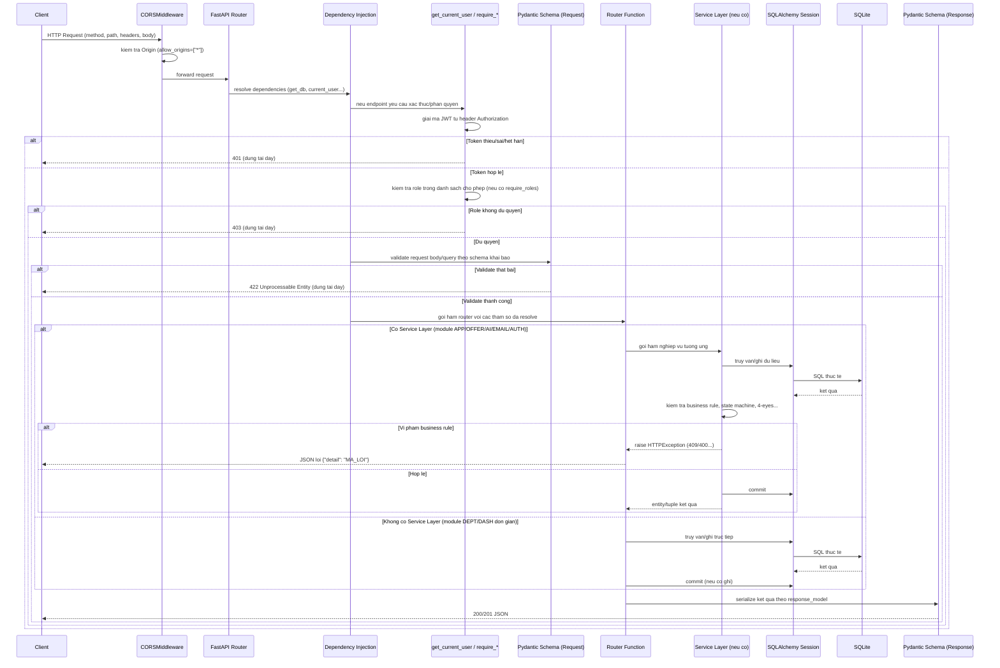

# 18 — GENERAL WORKFLOW — ATS v2.1

**Mục đích**: mô tả luồng xử lý **tổng quát** áp dụng cho cả 37 endpoint (khác với `15_UML.md` mục 2, vốn chỉ minh họa 3 luồng cụ thể). Nguồn: đối chiếu cấu trúc lặp lại giữa toàn bộ `app/routers/*.py` đã đọc ở các Đợt trước.

## 1. Luồng xử lý 1 HTTP Request (tổng quát)

## 2. Quy ước lỗi (Error Handling Convention)

`[CONFIRMED]` — toàn bộ lỗi nghiệp vụ dùng `fastapi.HTTPException(status_code, detail)`, `detail` luôn là 1 chuỗi **mã lỗi dạng SCREAMING_SNAKE_CASE** (VD `AI_CONSENT_REQUIRED`, `OFFER_SELF_APPROVAL_NOT_ALLOWED`), không phải câu văn tự nhiên — thiết kế để client (frontend) so khớp chuỗi và hiển thị thông báo phù hợp theo ngôn ngữ người dùng, tách biệt "mã lỗi kỹ thuật" khỏi "thông điệp hiển thị". Không có exception handler tùy chỉnh toàn cục (`@app.exception_handler`) — dùng nguyên cơ chế mặc định của FastAPI (`HTTPException` → JSON `{"detail": "..."}`, lỗi validate Pydantic → `422` với cấu trúc lỗi chi tiết từng field).

**Nhóm mã lỗi theo tầng**:

| Tầng phát sinh | HTTP Status thường gặp | Ví dụ |
|---|---|---|
| CORS/Auth (trước routing) | `401` | `NOT_AUTHENTICATED`, `INVALID_OR_EXPIRED_TOKEN` |
| RBAC (dependency) | `403` | `INSUFFICIENT_PERMISSION` |
| Pydantic (tự động, không phải HTTPException) | `422` | Lỗi định dạng field |
| Router (kiểm tra tồn tại/sở hữu) | `404`/`403` | `APPLICATION_NOT_FOUND`, `NOT_YOUR_APPLICATION` |
| Service (business rule/state machine) | `400`/`409` | `INVALID_STATUS_TRANSITION`, `OFFER_SELF_APPROVAL_NOT_ALLOWED` |

## 3. Luồng khởi động ứng dụng (Application Startup Workflow)

`[CONFIRMED]` — `app/main.py`:
1. Python import `app.main` → import toàn bộ router modules (đăng ký route vào FastAPI app instance).
2. Import `app.models` (side-effect: đăng ký toàn bộ model class với `Base.metadata`).
3. `lifespan()` context manager chạy khi `uvicorn` khởi động: gọi `Base.metadata.create_all(bind=engine)` — tạo bảng nếu chưa có (không migrate nếu đã có và schema đổi).
4. Đăng ký `CORSMiddleware`.
5. `include_router()` cho 10 router theo thứ tự cố định trong code (auth → users → departments → jobs → applications → offers → email_templates → ai → dashboard → audit) — thứ tự này **không ảnh hưởng hành vi** vì các router dùng prefix path khác nhau, không có route trùng path.
6. Mount `/static` (nếu thư mục tồn tại) + route `GET /` trả `index.html`.
7. `uvicorn` bắt đầu lắng nghe HTTP.

## 4. Luồng ghi Audit Log (Cross-cutting, áp dụng cho nhiều Use Case)

`[CONFIRMED]` — không phải middleware/interceptor tự động; mỗi service function **chủ động gọi** `audit_service.log(db, actor, action, entity_type, entity_business_id, before=..., after=..., reason=...)` tại đúng điểm cần ghi nhận, luôn **trong cùng transaction** với thay đổi dữ liệu chính (gọi trước `db.commit()` — xem `application_service.py`/`offer_service.py`, các lệnh `audit_service.log()` luôn đứng trước `db.commit()`), đảm bảo audit log và dữ liệu nghiệp vụ **commit hoặc rollback cùng nhau** (atomicity), không có tình huống ghi audit thành công nhưng dữ liệu chính rollback hoặc ngược lại.

---

*Kết thúc Đợt 6 (`16_DATABASE_DESIGN.md`, `17_TECHNOLOGY_STACK.md`, `18_GENERAL_WORKFLOW.md`). Tài liệu tiếp theo (Đợt 7 — đợt cuối): `19_TRACEABILITY_MATRIX.md`, `20_GAP_ANALYSIS.md`, `21_OPEN_QUESTIONS.md`, `22_FINAL_CONSISTENCY_REVIEW.md`.*
